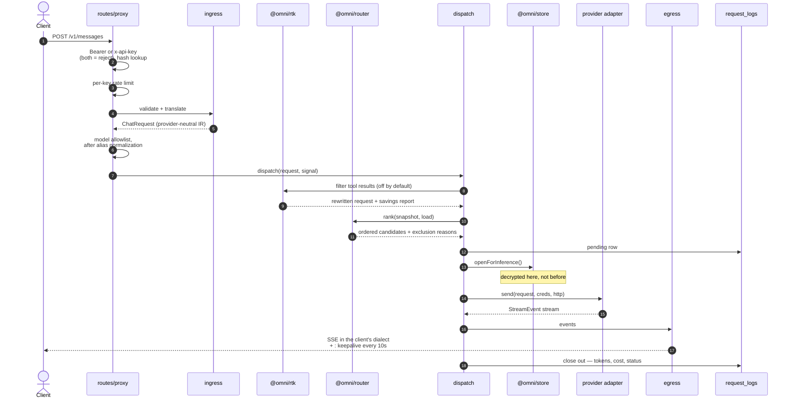
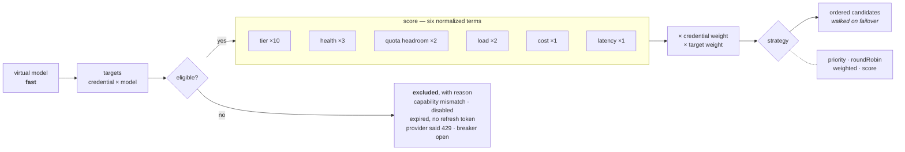
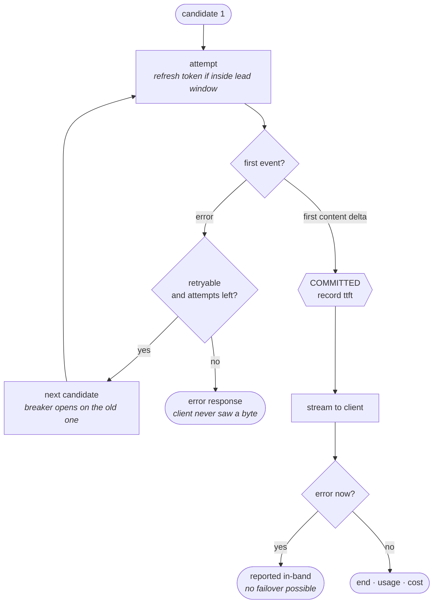
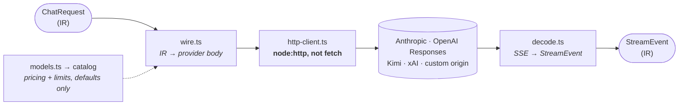
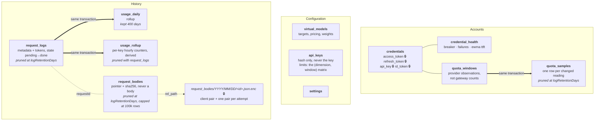
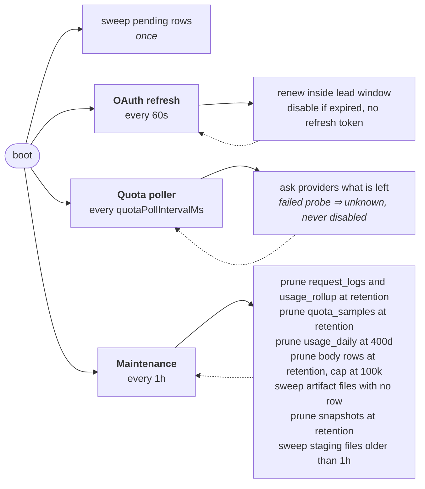
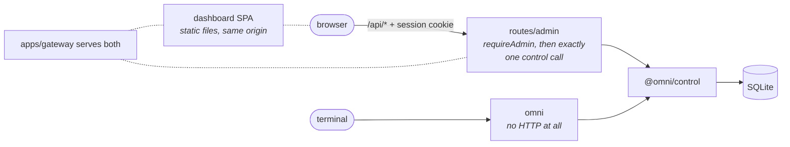

# Architecture

How OmniGateway is put together, for contributors and anyone auditing the
design. The [README](README.md#how-it-is-built) has the package map and the
layering rules; this document is the detail behind them.

For the conventions that govern changes — architectural boundaries, testing
expectations, and the traps worth knowing — see [CLAUDE.md](CLAUDE.md). Approved
designs live in `docs/superpowers/specs/`.

## Contents

- [What a request actually does](#what-a-request-actually-does)
- [Rate limiting](#rate-limiting)
- [Routing](#routing)
- [Dispatch](#dispatch)
- [Providers](#providers)
- [Storage](#storage)
  - [Replacing the database while it is open](#replacing-the-database-while-it-is-open)
- [Background loops](#background-loops)
  - [Stopping and restarting](#stopping-and-restarting)
- [The console and the CLI](#the-console-and-the-cli)
- [Plugins](#plugins)

## What a request actually does

`POST /v1/messages` and `POST /v1/chat/completions` are the same handler; the
dialect is a parameter.



Two details the diagram flattens. Credentials are decrypted at step 13 and not a
moment earlier, so ranking ten candidates costs zero decryptions. And the log row
is opened before the first attempt and closed exactly once — a client that hangs
up mid-stream is recorded as such, not as a success.

`GET /v1/models` is answered from the routing snapshot with no provider call, and
`POST /v1/messages/count_tokens` is estimated locally — it deliberately writes no
usage row.

## Rate limiting

Step 3 of that diagram is a sparse matrix, not a counter. A limit is a
`(dimension, window)` pair, and the pairs that exist are the ones that mean
something:

| Dimension | 1m | 5h | 1w | Counted from |
| --- | --- | --- | --- | --- |
| `requests` | ✓ | ✓ | ✓ | in-memory ring at `1m`; rollup + delta above it |
| `tokens` | ✓ | ✓ | ✓ | rollup + delta, debited on completion |
| `spend` (USD) | — | ✓ | ✓ | rollup + delta, debited on completion |
| `concurrency` | *no window — a gauge* | | | in-flight count in this process |

No `spend` at `1m` — a per-minute dollar ceiling is a rate limit in costume, and
`requests` and `tokens` already shape burst there. No `1d` either; `usage_daily`
is the reporting rollup, and every extra window is another counter to keep and
another header to render.

Every window **slides**. A fixed one resets on a clock edge, letting a key
limited to sixty a minute send sixty at `T+59s` and sixty more at `T+61s` — twice
its ceiling, no rule broken, at every window size.


Three things in that picture are load-bearing.

**The claim is synchronous.** The ring stamp and the gauge are taken before the
first `await`, and given back if the request is refused. Reading counters first
and recording after would let every concurrent request for a key judge the same
pre-burst snapshot — not a narrow race, since the `await` alone is enough to
yield and no I/O need be involved.

**The arithmetic is a pure package.** `@omni/ratelimit` holds no clock and no
state; `now` is a parameter and the counters are handed to it, so it never learns
whether a number came from memory or from SQLite. Rings and gauge live in
`apps/gateway`, which is what makes the arithmetic testable without a gateway, a
store, or a clock.

**The counts may run high and never low.** A long window is a rollup read cached
thirty seconds plus an in-memory delta, and requests aging out inside that window
are not subtracted — so the figure errs toward *refusing early*. The opposite
error is a limiter you can walk through by timing the cache refresh, which an
attacker can find and an operator cannot.

`tokens` and `spend` debit on completion, because an exact count exists only
then: a key at its ceiling is refused on its *next* request. So does `requests`
at `5h`/`1w`, for a different reason — those read committed rows, and an
admission held in the delta but pruned before its row landed would be counted
nowhere. A concurrent burst can therefore overshoot a long request ceiling by the
number in flight, which is what the `concurrency` gauge bounds.

That gauge is the one number with no expiry, which makes its release the most
dangerous line here. Non-streaming frees it in a request-scope `finally`; a
stream frees it from `sseResponse`'s run-once completion, because a streaming
handler returns as soon as the head is ready while the request runs on. A
decrement beside the debit never runs for a client that hung up; one in the
`finally` runs mid-stream. Either leaks a slot nothing reclaims, silently.

If the store cannot answer, long windows stop enforcing and the gateway logs it,
while `1m` and `concurrency` go on exactly — which is the justification for
serving rather than refusing: the limits that stop abuse fastest never touch the
database.

Limits live as one validated JSON object on `api_keys.limits`, so the dimension
and window names are persisted in every row — a storage contract like
`RTK_FILTER_IDS` with the opposite failure mode. An unknown RTK id is dropped on
read; an unknown limit key is a **parse failure**, because a limit read as "no
limit" fails open on a ceiling an operator set. That refusal lands at
authentication rather than in the row parser, so `keys.list()` still returns the
unparseable key, marked — the listing is how an operator finds the row to fix.

Clients see each vendor's own dialect — `anthropic-ratelimit-*`,
`x-ratelimit-*`, and `Retry-After` on every 429 — so an SDK backs off with the
code it already ships. `spend` and `concurrency` appear on neither: no vendor
defines a header for them.

## Routing

The router is a pure function over an immutable snapshot of credentials, health,
quota, models, and settings, plus a live count of in-flight requests. It returns
candidates in the order to try them, and every excluded account with its reason —
which is exactly what `omni models dry-run` prints.



The exclusion reading *provider said 429* is `credential_health.rate_limited_until`
— an upstream account this gateway is routing around, set from a provider's own
`Retry-After`. It is not the key limit above and not the quota-probe cooldown
either. Three unrelated things in this codebase are called a rate limit, they sit
at three different scopes — gateway key, provider credential, probe loop — and
only the first is a policy an operator authors.

Weights shown are the defaults and are configurable. A request carrying an
Anthropic-defined tool is excluded from every non-Anthropic target at the filter
stage — which is why it fails at routing with the requirement named, rather than
quietly losing the tool. The breaker's cooldown scales with consecutive failures.

Nothing here is thrown away: the exclusion list with its reasons is exactly what
`omni models dry-run` prints.

## Dispatch

Dispatch is where the side effects the router refuses to have actually live: the
request deadline, retries, failover, token refresh, health writes, cost pricing,
and load accounting.

The important rule is the **commit point**:



Everything left of the commit point is invisible to the client: a rate-limited or
broken account is swapped for another and the request simply succeeds. Everything
right of it is not, and pretending otherwise would corrupt the stream.

Circuit-breaker state and latency are written back on every terminal outcome, so
the next request's ranking reflects this one.

## Providers

`docs/adding-a-provider.md` is the procedure; this section is why the shape is
what it is.

Five adapters, each a directory of the same four files:



The `custom` adapter points another provider's codec at a different origin.

All outbound HTTP goes through one client, and that client is built on
`node:http` rather than `fetch` for a specific reason: Bun's `fetch` alphabetizes
request headers, which destroys the header order and casing providers use to
recognize a first-party CLI. The client preserves both verbatim, and logs only
host, path, status, and duration.

The catalog supplies defaults — pricing and context limits — at the moment you
create a target. The router then prices from the saved target, so editing the
catalog affects new targets only.

## Storage

One SQLite file, WAL mode, ten migrations — plus, when body capture is on, a
tree of encrypted artifacts beside it.



Writing the rollup in the *same transaction* as the log row is what lets a year of
usage history survive the 30-day pruning of the detailed logs.

`quota_samples` is written in the same transaction as the snapshot it describes, and only
when the reading actually changed — an idle account is re-read every poll interval and moves
nothing. `quota_windows` therefore answers "what is true now" and carries liveness in its
`observed_at`; `quota_samples` answers "how did it get here". The burn estimate needs only
the former, so it works on an install with no accumulated history.

Encryption is a boundary, not a pass. Only the four 🔒 fields are sealed, with
AES-256-GCM under a key derived from `OMNI_ENCRYPTION_KEY`, and decryption is
lazy and purpose-scoped — a credential opens *for inference*, *for refresh*, or
*for usage*, so ranking ten candidates costs zero decryptions. Gateway API keys
are not stored at all, only their hashes.

`request_bodies` is the one table whose payload is not in the database. Bodies
are the largest thing this gateway could store — one conversation with a pasted
file in it dwarfs the whole of `request_logs` — and inlining them would carry
every prompt through the same page cache, the same WAL, and the same `VACUUM` as
the routing tables, one `sqlite3` invocation from plaintext. The row therefore
holds a pointer and a `sha256` **over the ciphertext**, so on-disk truncation is
detectable by a reader that does not hold the key at all. That is what lets the
reader answer `missing` or `corrupt` instead of raising: a file tree and a table
that are not written transactionally together *will* drift, and expiry deletes
file and row explicitly rather than by `ON DELETE CASCADE`, because a silently
disabled `foreign_keys` pragma would turn expiry of a prompt corpus into
indefinite retention of one.

Capture needs two keys — `OMNI_BODY_LOGGING_ALLOWED` at boot and
`settings.bodyLoggingEnabled` at runtime — and a third can veto it: an API key
carrying `body_logging_opt_out` is never captured. Both are checked in
`apps/gateway/src/routes/proxy.ts` before any capture work begins. Reading back
is `readRequestBody` in `@omni/control`, served by `GET /api/requests/:id/body`
behind the same admin session as every other `/api/*` route.

One artifact holds the client pair and every wire pair together, so a failover
incident reads as one ordered story. The two are not the same payload: RTK's
`transformRequest` runs in dispatch before routing, so `client.request` is the
pre-filter conversation and every `attempts[].request` is the post-filter one.
`request_logs` already records which filters ran and how much they removed but
not *what*, and the artifact is the only place that can be read — which is why
the console labels each side rather than presenting them as interchangeable.

### Replacing the database while it is open

A snapshot is `VACUUM INTO` a file in `snapshots/` beside the database. That
folds the write-ahead log in by definition, so there is no `-wal` or `-shm` to
handle on the way out, and it reads through SQLite rather than copying the file,
so taking one against a live gateway yields a consistent database rather than a
torn one. The `request_bodies/` tree is excluded by construction: including it
would make every downloaded copy a prompt corpus and would make snapshot size
track prompt volume rather than database size. A restore therefore leaves the two
sides out of step, which is a state that already exists and is already handled:
the orphan sweep above collects files the restored `bodies` table no longer
references, and a row whose file is gone reads back as *captured, then lost*
rather than raising.
Retention — `keepLatest` and `maxAgeDays`, both enforced, newest always kept —
prunes when a snapshot is written *and* on the hourly sweep. Both, because the
create path alone is not a policy: an installation that stops taking snapshots
never expires one, and lowering `keepLatest` does nothing until somebody happens
to take another. The forced copy taken on the way into a restore skips the prune
during its own creation and stays exempt from every later one, because the undo
for an operation must not be deletable by the policy that operation runs under —
nor by ordinary housekeeping five manual snapshots later. The same sweep removes
staging files no operation is holding any more: an upload a refused import wrote,
and the `${db}.incoming` a swap that failed after its rename left behind. Both
are database-sized and nothing else looks at that directory.

Restoring one replaces the file every repo reads from, inside the process that is
reading it. Three pieces make that survivable.

**The store is swappable.** `createStore` returns a stable outer object whose repo
methods forward, *per call*, to a replaceable inner handle; `reopen()` closes the
inner handle and opens a new one at the same path, and `close()` is idempotent so
a restore can close, move a file, and reopen without a separate primitive. The
indirection is not decoration. The store is captured by value into five long-lived
holders at boot — the app, the refresher, and the three loops — and two dozen
modules are typed against `Store`, so closing and re-opening a connection
underneath them would leave every one of them holding repos bound to a dead
`Database`. Reading the handle per call is what makes the swap invisible to them.
It also means binding a repo method to a local defeats the whole mechanism and
strands that local on the closed handle. Routing subscribers live on the outer
object for the same reason: a listener registered at boot has to survive a
restore.

**A quiesce latch gates client traffic, and only client traffic.** `/v1/*` is
refused with a 503 and a `retry-after`, rendered by the same encoders the proxy
uses so an SDK gets an error in the dialect it already parses. `/api/*` and
`/health` stay live for the whole operation: the console is how an operator
watches a restore and how they hear that it failed, so a latch that covered the
whole server would black out the dashboard at the exact moment it is needed and
take the load balancer's health check with it.

What the latch waits for is requests being *answered*, not streams draining.
Elysia's `onAfterResponse` fires when the response is handed back, which for SSE
is long before the body ends. So the wait is bounded — ten seconds — and the latch
stays shut for the whole swap rather than only until the in-flight count reaches
zero, because a stream admitted before the close is still reading through the
handle the swap is about to replace.

**The sequence is ordered so that neither of the two things making it recoverable
can be skipped:** nothing is closed until the candidate has been judged, and
nothing is swapped until the undo exists.


The error seam is the distinction worth internalizing. Everything before the swap
— a file that fails `quick_check`, a file that is a database but not one of ours,
no room on disk for the undo, **no room for the staging copy** — fails with the
live database untouched, and the latch reopens immediately. The staging copy in
particular sits outside the swap's `try`, because a full disk is where it
actually fails and it fails having moved nothing: classing that as a failed swap
would refuse `/v1` until an operator restarted the process, over a database that
was never opened.

A failure *during* the swap raises `SwapFailedError`, and the gateway
deliberately leaves the latch shut: the file it would serve from is in an unknown
state, and refusing client traffic beats answering out of a half-swapped
database. The handle itself is reopened on the way out, best effort, and the
error carries whether that worked — because both halves of the documented
recovery run through it. `GET /api/database` reads PRAGMAs through that handle
and a second attempt takes its own undo snapshot through it, so a swap that left
the database closed would leave the panel blank and turn the retry into a
different, unrecognised failure. `/api/*` is still up, which is how an operator
reaches the pre-restore snapshot named in the log line.

The latch is reopened only by the call that shut it, and only on a failure. Two
mutating requests can overlap — a double-clicked button, two tabs — and the
single-flight guard that refuses the second lives *inside* the operation, which
the gateway reaches only after closing the latch. Without that rule the refused
request reopens the gate while the first is mid-swap, which is precisely the
window the latch exists to cover. Success reopens unconditionally, because
restoring the undo snapshot is the documented way out of a failed swap and it has
to end that outage rather than inherit it.

The required-tables check is the set migration 001 creates, not today's schema.
`openDb` migrates a snapshot forward on the way in, so asserting the current
tables would reject exactly the old backup an operator reaches for.

Two smaller placements carry weight. The candidate is copied to a staging name
*before* the handle closes, so the window with no database open is a rename and
not a file copy. And an uploaded database is streamed to a temp file beside the
live one rather than into `/tmp`, because the swap renames that file into place
and a rename across filesystems fails. That upload is bounded twice: by the byte
cap this gateway will accept at all, and by what the disk can take with room left
for the undo snapshot the import is about to write — the same precheck
`createSnapshot` runs, on the one path that accepts operator-supplied bytes. The
stale
`-wal` and `-shm` go while the handle is shut: they belong to the file being
replaced, and SQLite reopening a new database beside another database's
write-ahead log is how a restore becomes corruption.

Two pieces of derived state do not survive the swap on their own. The routing
snapshot cache checks staleness with SQLite's `data_version`, which is
connection-local — a freshly opened handle over a different file can report the
same number and serve a stale snapshot — so it is invalidated explicitly. Admin
sessions live in a `Map` rather than in the database, but `setPassword` clears
them, so a restore that writes a different password hash is that same "log
everyone out" event arriving by another door. The hashes are compared across the
swap and only a boolean leaves the operation, so restoring this installation's own
snapshot leaves the operator signed in.

A restore ends by rebuilding `usage_rollup`, and the *ordering* is the point.
Nothing may sit between the swap and the password comparison: by then the swap
has already succeeded, so a step that throws in front of the comparison skips the
session invalidation while the restored password is live. The rebuild therefore
runs last, and guarded — a stale rollup is an `omni doctor` complaint, a restore
that aborts after swapping is an outage. It is recomputed rather than trusted
because nothing in a file an operator hands over says whether its counters agree
with its rows. `bun:sqlite` is synchronous, so it blocks the loop — and so
`/api/*` and `/health` — for ≈0.4 s per 500k `request_logs` rows, ≈1.6 s at 2M,
≈6.5 s at 8M.

The CLI cannot do any of this, and refuses rather than trying: `omni db restore`
stops if a gateway is running against that installation, with no override. A
second process can reopen its own handle but cannot quiesce the gateway's, and
renaming the file under a live SQLite connection corrupts the database being
rescued.

## Background loops

Three, started at boot and stopped on signal:



Setting `quotaPollIntervalMs` to zero disables the poller entirely; it is read
once at boot. Retiring the `pending` rows at startup is what stops a crash from
double-counting usage.

Body rows expire on the same sweep as the request logs they belong to, rather
than on a schedule of their own, so an artifact can never outlive its log line.
The row cap runs beside the window because the window bounds nothing: at
sustained load a seven-day retention over full traffic is unbounded in practice.
The orphan sweep exists because a crash between the file write and the row write
leaves a file nothing will ever come back for.

### Stopping and restarting

A signal and `POST /api/lifecycle/shutdown` reach the same teardown. They used to
be unable to: the server, the store, and the three loop stoppers are locals of the
bootstrap, so a handler defined anywhere else had nothing to stop. `createShutdown`
closes over them once, and both callers get the same shutdown — loops first,
because a timer that fires while the socket drains reaches a store that is about
to close, then the server, then the store, then exit. A second request while the
first is draining escalates, on the theory that the first one is evidently stuck.

The drain is bounded at five seconds. Bun stops a server by letting its
connections finish, and a shutdown asked for over HTTP arrives on one of them, so
the request that asked for the shutdown is itself a reason the shutdown cannot
complete — the gateway answered `ok` and then stayed alive until a second signal
escalated. A signal never hits this, because a shell holds no socket. On timeout
the process exits **0**: a nonzero code would read to `Restart=on-failure` as a
crash and resurrect a gateway an operator just asked to stop.

Restart is not shutdown, and what it takes depends on what is watching. The
capability is detected rather than assumed. `JOURNAL_STREAM` is systemd's own
statement that it is capturing this process, which beats looking for an installed
unit file — that says a unit exists, not that this process is the one it started —
and `MANAGERPID` distinguishes the user manager from the system one, because the
uid is wrong in both directions. Failing that, `/.dockerenv` means a container.
Failing both, nothing would respawn the process and restart is refused.

Under systemd the gateway asks the manager instead of signalling itself:

```
systemctl [--user] --no-block restart omnigateway.service
```

The unit the CLI installs sets `Restart=on-failure`, and a handled `SIGTERM` exits
zero, which systemd reads as success — a self-signalling gateway would stop and
stay stopped. `--no-block` is load-bearing: restarting the unit tears down its
whole cgroup, which contains the `systemctl` client just spawned, so a blocking
call is killed mid-wait while the queued job survives. Asking also fails better.
A refused `systemctl` is an ordinary error response from a gateway that is still
running and still serving, rather than a process that killed itself and hoped.

A container's restart policy is the one capability here that is a hope rather than
a fact — it is not readable from inside the container — so a restart is an exit
with code 0 and the console reports the uncertainty instead of promising. With no
supervisor at all `canRestart` is false, because `omni start` without a unit is a
detached spawn with a pidfile and nothing watching it. Shutdown stays available in
every shape; stopping is the point of it.

`describeLifecycle` is a pure function of the environment and one path probe,
which is what lets the console disable a control and print the reason rather than
letting an operator press it and find out.

## The console and the CLI

Two front ends, one set of operations, two very different paths to it:



The console is a React SPA the gateway serves as static files from its own
origin; it may import types and the model catalog, never a provider adapter or
the HTTP client. The CLI skips the server completely and opens the database
itself — same operations, no running gateway required.

Reading a captured body is one of those operations, not a route's own logic:
`readRequestBody` decides that a swept or undecryptable artifact is a state to
report rather than an error to raise, and the handler adds no error mapping that
could quote a path or a stack back. It carries no CLI command yet, which is the
only asymmetry between the two front ends. `GET /api/settings` additionally
reports `bodyLoggingAllowed` beside the settings, because the runtime toggle is
meaningless without the boot-time key and a console that knew only the setting
would render a switch that silently does nothing.

## Plugins

A plugin adds routes, storage and console UI to one installation without being
part of this repository. They are loaded from `<root>/plugins/` at boot, in
lexicographic id order so two installs with the same plugins behave the same way.
`docs/writing-a-plugin.md` is the procedure; this section is why the shape is
what it is.

### The trust boundary, which is not one

A plugin is `import`ed into the gateway process, and that process holds the
encryption key, decrypted provider credentials, admin session state and API-key
hashes. Bun offers no in-process sandbox. The capability context is therefore a
**guardrail rather than a sandbox**: it makes accidental overreach impossible and
a plugin's intent auditable from its manifest, and it does not stop hostile code,
which can reach past it by importing the store directly.

A supervised subprocess with an IPC protocol would be a real boundary. It was
considered and deferred on cost — process supervision, protocol versioning,
restart semantics — and the decision is recorded rather than assumed. If this
project ever accepts plugins it does not control, that is the point to revisit,
before rather than after.

### Every failure is survivable

A malformed manifest, an incompatible API major, an entry that will not import, a
setup that throws, a migration that fails: each skips one plugin, is reported to
stdout and to `omni doctor`, and leaves the gateway serving. The asymmetry is
deliberate. The proxy path depends on no plugin and must not become able to, and
a gateway that refuses to start because an optional cosmetic feature has a syntax
error has converted a nuisance into an outage — while also removing the console
an operator would use to find out which plugin to remove.

### Storage rides the database, on its own track

Plugin tables live in the gateway's own SQLite file, so a plugin's data moves
with a snapshot and a restore like everything else. They are named
`plugin_<id>_<name>` by the host from a `{{name}}` placeholder the plugin writes,
and tracked in `plugin_migrations` independently of core's numbering — core's
next migration is unaffected by anything a plugin does.

Plugin migrations apply one transaction each rather than one for the batch. A
single transaction reads tidier and is wrong: a plugin failing on migration 5
would silently revert 1 through 4 on every subsequent boot, turning one bad
migration into repeated data loss.

Restoring onto an install that lacks a plugin leaves orphan `plugin_*` tables.
They stay, `omni doctor` reports them, and nothing drops them automatically — a
restore is precisely when a plugin may not be installed yet, and the drop is
irreversible.

### Events are at-most-once, and say so

`RequestCompleted` is emitted from `finishLog`, which is already the one site
running at most once per request id — the same guarantee, and the same reason,
that put the rate-limiter's token debit there. Handlers run off the request path
through a bounded queue: nothing runs on the caller's stack, a throwing handler
costs that plugin its event and nothing else, and a full queue drops rather than
grows, because an unbounded queue behind a slow handler is a memory leak that
only appears under load.

Delivery is explicitly **not durable**. An event queued when the process dies is
gone. That is fine for a counter and wrong for a ledger, and the distinction is
documented rather than left for someone to assume the wrong half.

### The console shares one React

Plugins render inline in the console, which means both halves must hold the same
React instance — two copies make every plugin hook throw. So the console
externalises `react`, `react-dom`, `styled-components` and `@tanstack/react-query`
rather than bundling them, and an import map in `index.html` resolves those bare
specifiers to a shared runtime built beside it. The specifier list, the import
map and the shared build's entry points are one object in
`apps/dashboard/shared/manifest.ts`, because those three drifting apart fails in
three different and equally unhelpful ways.

An `sdk` range that the shipped console does not satisfy disables only the UI, and
the nav entry renders disabled carrying the reason. A plugin that collects data
should not go dark because the console's React moved, and an operator should get
a sentence rather than a blank page.
