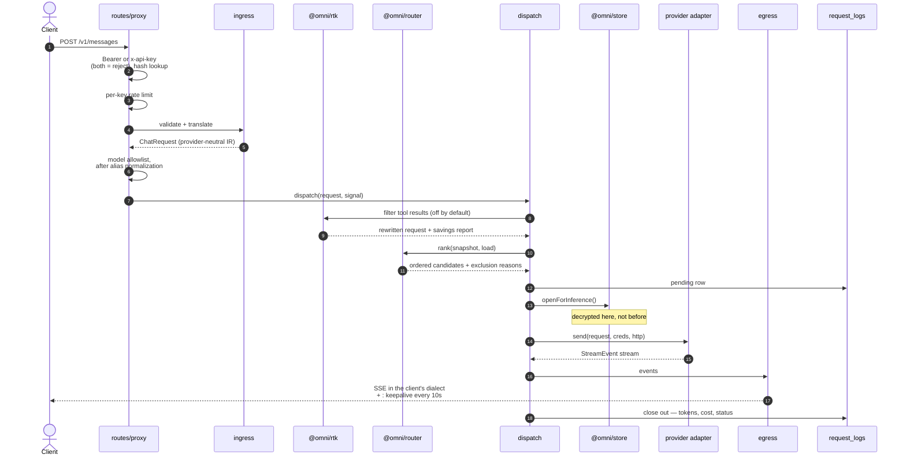
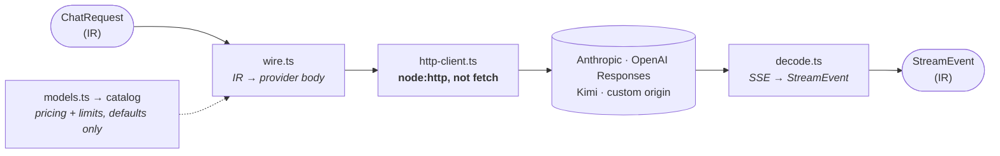
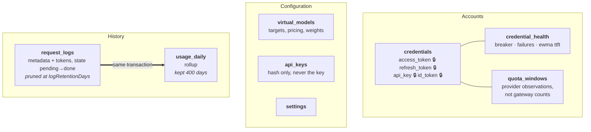
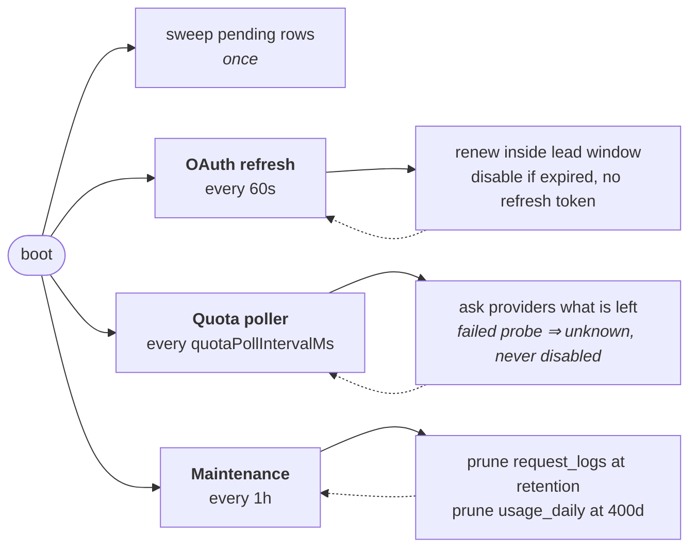

# Architecture

How OmniGateway is put together, for contributors and anyone auditing the
design. The [README](README.md#how-it-is-built) has the package map and the
layering rules; this document is the detail behind them.

For the conventions that govern changes — architectural boundaries, testing
expectations, and the traps worth knowing — see [CLAUDE.md](CLAUDE.md). Approved
designs live in `docs/superpowers/specs/`.

## Contents

- [What a request actually does](#what-a-request-actually-does)
- [Routing](#routing)
- [Dispatch](#dispatch)
- [Providers](#providers)
- [Storage](#storage)
- [Background loops](#background-loops)
- [The console and the CLI](#the-console-and-the-cli)

## What a request actually does

`POST /v1/messages` and `POST /v1/chat/completions` are the same handler; the
dialect is a parameter.

Two details the diagram flattens. Credentials are decrypted at step 13 and not a
moment earlier, so ranking ten candidates costs zero decryptions. And the log row
is opened before the first attempt and closed exactly once — a client that hangs
up mid-stream is recorded as such, not as a success.

`GET /v1/models` is answered from the routing snapshot with no provider call, and
`POST /v1/messages/count_tokens` is estimated locally — it deliberately writes no
usage row.

## Routing

The router is a pure function over an immutable snapshot of credentials, health,
quota, models, and settings, plus a live count of in-flight requests. It returns
candidates in the order to try them, and every excluded account with its reason —
which is exactly what `omni models dry-run` prints.

Weights shown are the defaults and are configurable. A request carrying an
Anthropic-defined tool is excluded from every non-Anthropic target at the filter
stage — which is why it fails at routing with the requirement named, rather than
quietly losing the tool. The breaker's cooldown scales with consecutive failures.

Nothing here is thrown away: the exclusion list with its reasons is exactly what
`omni models dry-run` prints.

## Dispatch

Dispatch is where the side effects the router refuses to have actually live: the
request deadline, retries, failover, token refresh, health writes, cost pricing,
and load accounting.

The important rule is the **commit point**:

Everything left of the commit point is invisible to the client: a rate-limited or
broken account is swapped for another and the request simply succeeds. Everything
right of it is not, and pretending otherwise would corrupt the stream.

Circuit-breaker state and latency are written back on every terminal outcome, so
the next request's ranking reflects this one.

## Providers

Four adapters, each a directory of the same four files:

The `custom` adapter points another provider's codec at a different origin.

All outbound HTTP goes through one client, and that client is built on
`node:http` rather than `fetch` for a specific reason: Bun's `fetch` alphabetizes
request headers, which destroys the header order and casing providers use to
recognize a first-party CLI. The client preserves both verbatim, and logs only
host, path, status, and duration.

The catalog supplies defaults — pricing and context limits — at the moment you
create a target. The router then prices from the saved target, so editing the
catalog affects new targets only.

## Storage

One SQLite file, WAL mode, six migrations.

Writing the rollup in the *same transaction* as the log row is what lets a year of
usage history survive the 30-day pruning of the detailed logs.

Encryption is a boundary, not a pass. Only the four 🔒 fields are sealed, with
AES-256-GCM under a key derived from `OMNI_ENCRYPTION_KEY`, and decryption is
lazy and purpose-scoped — a credential opens *for inference*, *for refresh*, or
*for usage*, so ranking ten candidates costs zero decryptions. Gateway API keys
are not stored at all, only their hashes.

## Background loops

Three, started at boot and stopped on signal:

Setting `quotaPollIntervalMs` to zero disables the poller entirely; it is read
once at boot. Retiring the `pending` rows at startup is what stops a crash from
double-counting usage.

## The console and the CLI

Two front ends, one set of operations, two very different paths to it:

The console is a React SPA the gateway serves as static files from its own
origin; it may import types and the model catalog, never a provider adapter or
the HTTP client. The CLI skips the server completely and opens the database
itself — same operations, no running gateway required.
