# Architecture

How OmniGateway put together, for contributors and design auditors. [README](README.md#how-it-is-built) has package map and layering rules; this doc detail behind them.

Conventions governing changes — architectural boundaries, testing expectations, traps — see [CLAUDE.md](CLAUDE.md). Approved designs live in `docs/superpowers/specs/`.

## Contents

- [What a request actually does](#what-a-request-actually-does)
- [Rate limiting](#rate-limiting)
- [Routing](#routing)
- [Dispatch](#dispatch)
- [Providers](#providers)
- [Storage](#storage)
  - [Replacing the database while it is open](#replacing-the-database-while-it-is-open)
- [Background loops](#background-loops)
  - [Stopping and restarting](#stopping-and-restarting)
- [The console and the CLI](#the-console-and-the-cli)
- [Plugins](#plugins)

## What a request actually does

`POST /v1/messages` and `POST /v1/chat/completions` same handler; dialect is parameter.

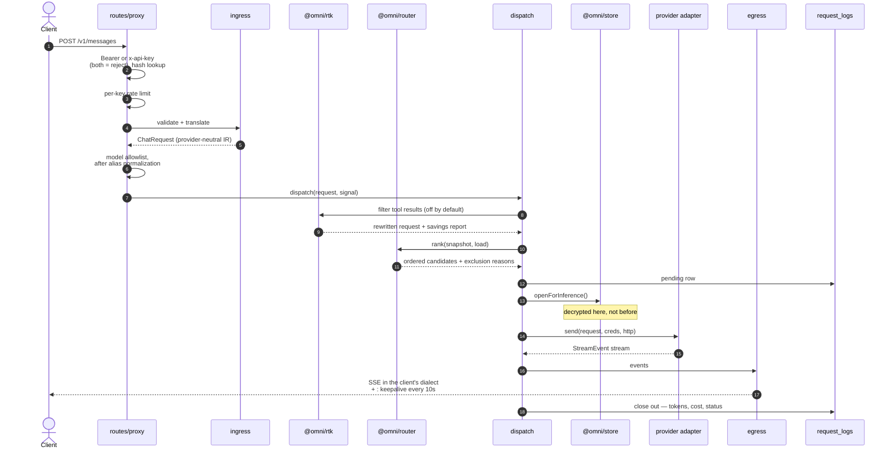

Two details diagram flattens. Credentials decrypt at step 13, not sooner — ranking ten candidates costs zero decryptions. Log row opens before first attempt, closes exactly once — client hanging up mid-stream recorded as such, not success.

`GET /v1/models` answered from routing snapshot, no provider call. `POST /v1/messages/count_tokens` estimated locally — deliberately writes no usage row.

## Rate limiting

Step 3 is sparse matrix, not counter. Limit = `(dimension, window)` pair. Pairs that exist are ones that mean something:

| Dimension | 1m | 5h | 1w | Counted from |
| --- | --- | --- | --- | --- |
| `requests` | ✓ | ✓ | ✓ | in-memory ring at `1m`; rollup + delta above it |
| `tokens` | ✓ | ✓ | ✓ | rollup + delta, debited on completion |
| `spend` (USD) | — | ✓ | ✓ | rollup + delta, debited on completion |
| `concurrency` | *no window — a gauge* | | | in-flight count in this process |

No `spend` at `1m` — per-minute dollar ceiling is rate limit in costume; `requests` and `tokens` already shape burst there. No `1d` either; `usage_daily` is reporting rollup, and every extra window is another counter to keep, another header to render.

Every window **slides**. Fixed one resets on clock edge, letting key limited to sixty a minute send sixty at `T+59s`, sixty more at `T+61s` — twice ceiling, no rule broken, at every window size.

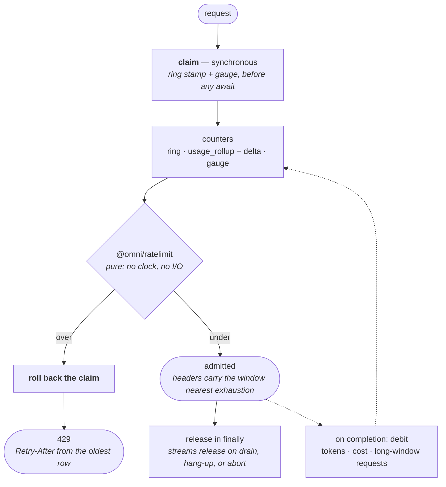

Three things load-bearing there.

**Claim is synchronous.** Ring stamp and gauge taken before first `await`, given back if request refused. Read-first-record-after would let every concurrent request for a key judge same pre-burst snapshot — not narrow race, since `await` alone enough to yield and no I/O need be involved.

**Arithmetic is pure package.** `@omni/ratelimit` holds no clock, no state; `now` is parameter, counters handed to it, so it never learns whether number came from memory or SQLite. Rings and gauge live in `apps/gateway` — that what makes arithmetic testable without gateway, store, or clock.

**Counts may run high, never low.** Long window = rollup read cached thirty seconds plus in-memory delta; requests aging out inside that window not subtracted — figure errs toward *refusing early*. Opposite error is limiter you walk through by timing cache refresh, which attacker finds and operator cannot.

`tokens` and `spend` debit on completion, because exact count exists only then: key at ceiling refused on *next* request. So does `requests` at `5h`/`1w`, different reason — those read committed rows, and admission held in delta but pruned before its row landed counted nowhere. Concurrent burst can therefore overshoot long request ceiling by number in flight — what `concurrency` gauge bounds.

That gauge is one number with no expiry, making its release most dangerous line here. Non-streaming frees it in request-scope `finally`; stream frees it from `sseResponse`'s run-once completion, because streaming handler returns as soon as head ready while request runs on. Decrement beside debit never runs for client that hung up; one in `finally` runs mid-stream. Either leaks slot nothing reclaims, silently.

If store cannot answer, long windows stop enforcing and gateway logs it, while `1m` and `concurrency` go on exactly — justification for serving rather than refusing: limits that stop abuse fastest never touch database.

Limits live as one validated JSON object on `api_keys.limits`, so dimension and window names persisted in every row — storage contract like `RTK_FILTER_IDS` with opposite failure mode. Unknown RTK id dropped on read; unknown limit key is **parse failure**, because limit read as "no limit" fails open on ceiling operator set. That refusal lands at authentication rather than row parser, so `keys.list()` still returns unparseable key, marked — listing is how operator finds row to fix.

Clients see each vendor's own dialect — `anthropic-ratelimit-*`, `x-ratelimit-*`, `Retry-After` on every 429 — so SDK backs off with code it already ships. `spend` and `concurrency` appear on neither: no vendor defines header for them.

## Routing

Router is pure function over immutable snapshot of credentials, health, quota, models, settings, plus live count of in-flight requests. Returns candidates in order to try, and every excluded account with its reason — exactly what `omni models dry-run` prints.

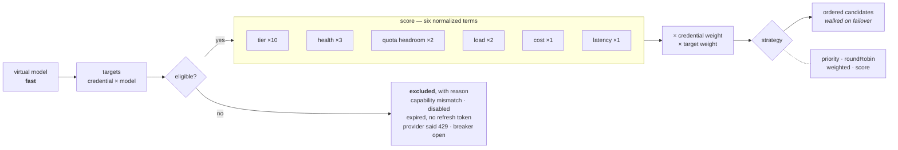

Exclusion reading *provider said 429* is `credential_health.rate_limited_until` — upstream account this gateway routing around, set from provider's own `Retry-After`. Not the key limit above, not the quota-probe cooldown either. Three unrelated things in this codebase called rate limit, sitting at three scopes — gateway key, provider credential, probe loop — and only first is policy an operator authors.

Weights shown are defaults, configurable. Request carrying Anthropic-defined tool excluded from every non-Anthropic target at filter stage — why it fails at routing with requirement named, rather than quietly losing tool. Breaker cooldown scales with consecutive failures.

Nothing here thrown away: exclusion list with reasons is exactly what `omni models dry-run` prints.

## Dispatch

Dispatch is where side effects router refuses to have actually live: request deadline, retries, failover, token refresh, health writes, cost pricing, load accounting.

Important rule is **commit point**:


Everything left of commit point invisible to client: rate-limited or broken account swapped for another, request simply succeeds. Everything right of it is not, and pretending otherwise would corrupt stream.

Circuit-breaker state and latency written back on every terminal outcome, so next request's ranking reflects this one.

## Providers

Six adapters. Five are directories of roughly same four files — `wire.ts`, `decode.ts`, `models.ts`, `index.ts` — plus whatever that provider alone needs: `anthropic` carries `tools.ts` for versioned tool types, `kimi` and `grok` carry `device.ts` for device-code flows.

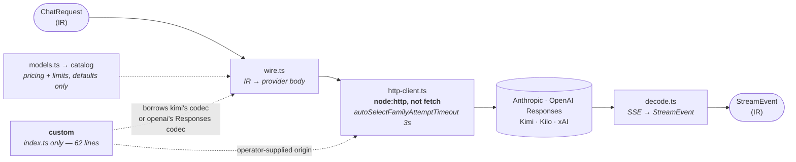

Sixth, `custom`, has no `wire.ts` and no `decode.ts` of its own: existing codec pointed at operator-supplied origin, and that whole adapter.

All outbound HTTP goes through one client, built on `node:http` rather than `fetch` for specific reason: Bun's `fetch` alphabetizes request headers, destroying header order and casing providers use to recognize first-party CLI. Client preserves both verbatim, logs only host, path, status, duration.

One constant in that client worth naming, because failure it prevents reads as provider outage and is not one. Node's `autoSelectFamily` on by default, gives each address family fixed budget before moving to next — budget whose default is *below* Linux's one-second initial TCP retransmit timeout. So dropped SYN, routine on lossy path, abandoned at ~500 ms instead of recovering at ~1000 ms, and where other family cannot serve at all (AAAA record, no IPv6 route) both attempts spent and connect simply fails. `CONNECT_ATTEMPT_TIMEOUT_MS` raises it to 3 s, pinned by test asserting it stays above that RTO. Measured: 3 failures in 99 connects at default, 0 in 212 once raised, previously-failing connects completing at 1007–1061 ms.

Catalog supplies defaults — pricing and context limits — at moment you create target. Router then prices from saved target, so editing catalog affects new targets only.

## Storage

One SQLite file, WAL mode, eleven migrations — plus, when body capture on, tree of encrypted artifacts beside it.

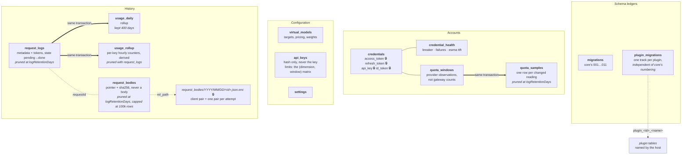

Admin sessions not on that diagram because not in database: they live in `Map` in gateway process — why restart signs everyone out, why restore must end them explicitly rather than by replacing table.

Writing rollup in *same transaction* as log row is what lets year of usage history survive 30-day pruning of detailed logs.

`quota_samples` written in same transaction as snapshot it describes, only when reading actually changed — idle account re-read every poll interval, moves nothing. `quota_windows` therefore answers "what is true now" and carries liveness in `observed_at`; `quota_samples` answers "how did it get here". Burn estimate needs only former, so works on install with no accumulated history.

Encryption is boundary, not pass. Only four 🔒 fields sealed, AES-256-GCM under key derived from `OMNI_ENCRYPTION_KEY`, decryption lazy and purpose-scoped — credential opens *for inference*, *for refresh*, or *for usage*, so ranking ten candidates costs zero decryptions. Gateway API keys not stored at all, only hashes.

`request_bodies` is one table whose payload not in database. Bodies are largest thing this gateway could store — one conversation with pasted file dwarfs whole of `request_logs` — and inlining them would carry every prompt through same page cache, same WAL, same `VACUUM` as routing tables, one `sqlite3` invocation from plaintext. Row therefore holds pointer and `sha256` **over the ciphertext**, so on-disk truncation detectable by reader holding no key at all. That what lets reader answer `missing` or `corrupt` instead of raising: file tree and table not written transactionally together *will* drift, and expiry deletes file and row explicitly rather than by `ON DELETE CASCADE`, because silently disabled `foreign_keys` pragma would turn expiry of prompt corpus into indefinite retention of one.

Capture needs two keys — `OMNI_BODY_LOGGING_ALLOWED` at boot, `settings.bodyLoggingEnabled` at runtime — and third can veto: API key carrying `body_logging_opt_out` never captured. Both checked in `apps/gateway/src/routes/proxy.ts` before any capture work begins. Reading back is `readRequestBody` in `@omni/control`, served by `GET /api/requests/:id/body` behind same admin session as every other `/api/*` route.

One artifact holds client pair and every wire pair together, so failover incident reads as one ordered story. The two not same payload: RTK's `transformRequest` runs in dispatch before routing, so `client.request` is pre-filter conversation and every `attempts[].request` is post-filter one. `request_logs` already records which filters ran and how much they removed but not *what*; artifact is only place that can be read — why console labels each side rather than presenting them as interchangeable.

### Replacing the database while it is open

Snapshot is `VACUUM INTO` a file in `snapshots/` beside database. That folds write-ahead log in by definition, so no `-wal` or `-shm` to handle on way out, and it reads through SQLite rather than copying file, so taking one against live gateway yields consistent database, not torn one. `request_bodies/` tree excluded by construction: including it would make every downloaded copy a prompt corpus and make snapshot size track prompt volume rather than database size. Restore therefore leaves the two sides out of step — state that already exists and is already handled: orphan sweep above collects files restored `bodies` table no longer references, and row whose file is gone reads back as *captured, then lost* rather than raising.
Retention — `keepLatest` and `maxAgeDays`, both enforced, newest always kept — prunes when snapshot written *and* on hourly sweep. Both, because create path alone is not policy: install that stops taking snapshots never expires one, and lowering `keepLatest` does nothing until somebody happens to take another. Forced copy taken on way into restore skips prune during its own creation and stays exempt from every later one, because undo for an operation must not be deletable by policy that operation runs under — nor by ordinary housekeeping five manual snapshots later. Same sweep removes staging files no operation holds any more: upload a refused import wrote, and `${db}.incoming` a swap that failed after its rename left behind. Both database-sized, nothing else looks at that directory.

Restoring one replaces file every repo reads from, inside process reading it. Three pieces make that survivable.

**Store is swappable.** `createStore` returns stable outer object whose repo methods forward, *per call*, to replaceable inner handle; `reopen()` closes inner handle and opens new one at same path, and `close()` is idempotent so restore can close, move file, reopen without separate primitive. Indirection not decoration. Store captured by value into five long-lived holders at boot — app, refresher, three loops — and two dozen modules typed against `Store`, so closing and re-opening connection underneath them would leave every one holding repos bound to dead `Database`. Reading handle per call is what makes swap invisible to them. Also means binding repo method to local defeats whole mechanism and strands that local on closed handle. Routing subscribers live on outer object for same reason: listener registered at boot must survive restore.

**Quiesce latch gates client traffic, and only client traffic.** `/v1/*` refused with 503 and `retry-after`, rendered by same encoders proxy uses so SDK gets error in dialect it already parses. `/api/*` and `/health` stay live for whole operation: console is how operator watches restore and how they hear it failed, so latch covering whole server would black out dashboard at exact moment it needed and take load balancer's health check with it.

What latch waits for is requests being *answered*, not streams draining. Elysia's `onAfterResponse` fires when response handed back, which for SSE is long before body ends. So wait is bounded — ten seconds — and latch stays shut for whole swap rather than only until in-flight count hits zero, because stream admitted before close still reads through handle swap is about to replace.

**Sequence ordered so neither of two things making it recoverable can be skipped:** nothing closed until candidate judged, nothing swapped until undo exists.

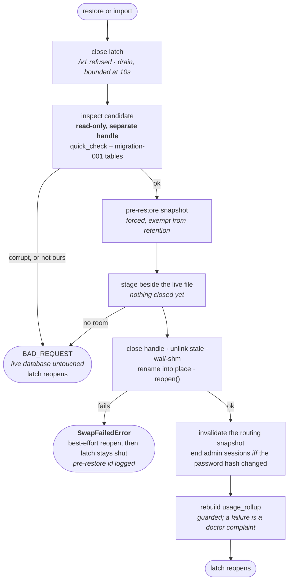

Error seam is distinction worth internalizing. Everything before swap — file failing `quick_check`, file that is database but not ours, no room on disk for undo, **no room for staging copy** — fails with live database untouched, latch reopens immediately. Staging copy in particular sits outside swap's `try`, because full disk is where it actually fails and it fails having moved nothing: classing that as failed swap would refuse `/v1` until operator restarted process, over database never opened.

Failure *during* swap raises `SwapFailedError`, and gateway deliberately leaves latch shut: file it would serve from is in unknown state, and refusing client traffic beats answering out of half-swapped database. Handle itself reopened on way out, best effort, and error carries whether that worked — because both halves of documented recovery run through it. `GET /api/database` reads PRAGMAs through that handle and second attempt takes its own undo snapshot through it, so swap that left database closed would leave panel blank and turn retry into different, unrecognised failure. `/api/*` still up — how operator reaches pre-restore snapshot named in log line.

Latch reopened only by call that shut it, and only on failure. Two mutating requests can overlap — double-clicked button, two tabs — and single-flight guard refusing second lives *inside* operation, which gateway reaches only after closing latch. Without that rule refused request reopens gate while first mid-swap — precisely the window latch exists to cover. Success reopens unconditionally, because restoring undo snapshot is documented way out of failed swap and it must end that outage rather than inherit it.

Required-tables check is set migration 001 creates, not today's schema. `openDb` migrates snapshot forward on way in, so asserting current tables would reject exactly the old backup operator reaches for.

Two smaller placements carry weight. Candidate copied to staging name *before* handle closes, so window with no database open is a rename, not a file copy. And uploaded database streamed to temp file beside live one rather than into `/tmp`, because swap renames that file into place and rename across filesystems fails. That upload bounded twice: by byte cap this gateway accepts at all, and by what disk can take with room left for undo snapshot import about to write — same precheck `createSnapshot` runs, on the one path accepting operator-supplied bytes. Stale
`-wal` and `-shm` go while handle shut: they belong to file being replaced, and SQLite reopening new database beside another database's write-ahead log is how restore becomes corruption.

Two pieces of derived state don't survive swap on own. Routing snapshot cache checks staleness with SQLite's `data_version`, which is connection-local — freshly opened handle over different file can report same number and serve stale snapshot — so invalidated explicitly. Admin sessions live in `Map` rather than database, but `setPassword` clears them, so restore writing different password hash is that same "log everyone out" event arriving by another door. Hashes compared across swap and only boolean leaves operation, so restoring this install's own snapshot leaves operator signed in.

Restore ends by rebuilding `usage_rollup`, and *ordering* is the point. Nothing may sit between swap and password comparison: by then swap already succeeded, so step that throws in front of comparison skips session invalidation while restored password is live. Rebuild therefore runs last, guarded — stale rollup is `omni doctor` complaint, restore aborting after swap is outage. Recomputed rather than trusted because nothing in file an operator hands over says whether its counters agree with its rows. `bun:sqlite` is synchronous, so it blocks loop — and so `/api/*` and `/health` — for ≈0.4 s per 500k `request_logs` rows, ≈1.6 s at 2M, ≈6.5 s at 8M.

CLI cannot do any of this, and refuses rather than trying: `omni db restore` stops if gateway running against that installation, no override. Second process can reopen own handle but cannot quiesce gateway's, and renaming file under live SQLite connection corrupts the database being rescued.

## Background loops

Three timers, plus queue drain stopped alongside them:

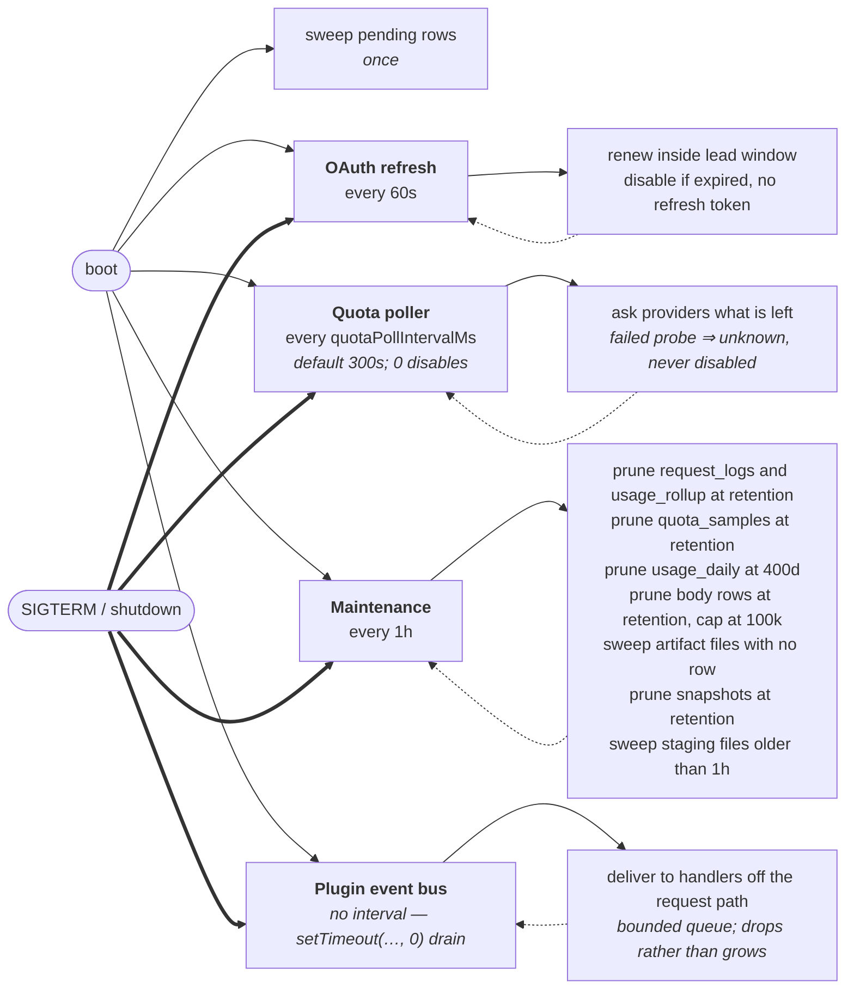

Event bus is fourth entry in same stopper list, and teardown treats it as loop like others even though it has no interval — it holds queued work, and work running after store closes reaches closed handle exactly the way late timer would.

Setting `quotaPollIntervalMs` to zero disables poller entirely; read once at boot. Retiring `pending` rows at startup is what stops crash from double-counting usage.

Body rows expire on same sweep as request logs they belong to, rather than own schedule, so artifact can never outlive its log line. Row cap runs beside window because window bounds nothing: at sustained load, seven-day retention over full traffic is unbounded in practice. Orphan sweep exists because crash between file write and row write leaves file nothing will ever come back for.

### Stopping and restarting

Signal and `POST /api/lifecycle/shutdown` reach same teardown. They used to be unable to: server, store, and three loop stoppers are locals of bootstrap, so handler defined anywhere else had nothing to stop. `createShutdown` closes over them once, and both callers get same shutdown — loops first, because timer firing while socket drains reaches store about to close, then server, then store, then exit. Second request while first draining escalates, on theory first one evidently stuck.

Drain bounded at five seconds. Bun stops server by letting connections finish, and shutdown asked for over HTTP arrives on one of them, so request asking for shutdown is itself reason shutdown cannot complete — gateway answered `ok` then stayed alive until second signal escalated. Signal never hits this, because shell holds no socket. On timeout process exits **0**: nonzero code would read to `Restart=on-failure` as crash and resurrect gateway operator just asked to stop.

Restart is not shutdown, and what it takes depends on what is watching. Capability detected rather than assumed:

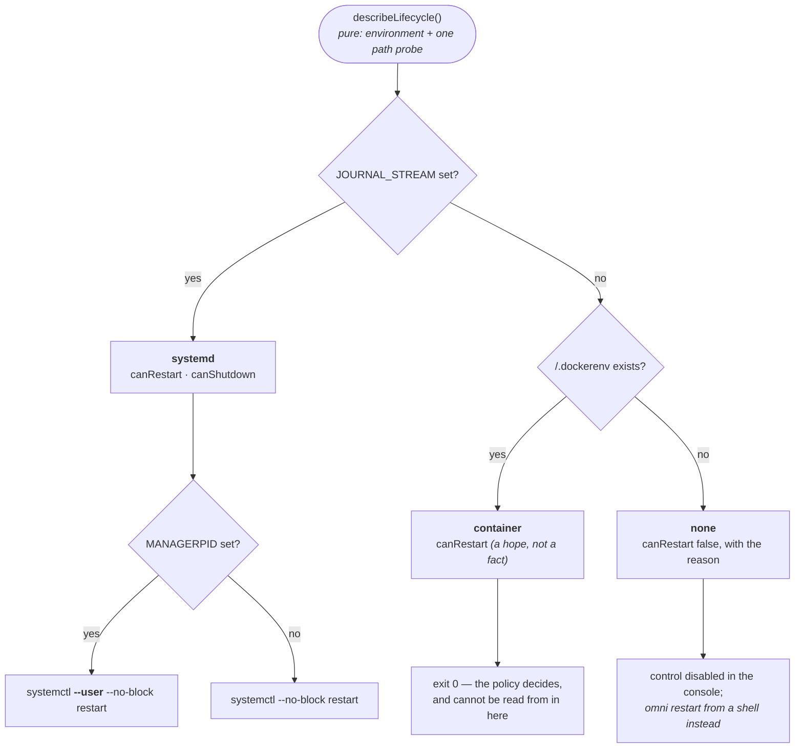

`JOURNAL_STREAM` is systemd's own statement it captures *this* process, which beats looking for installed unit file — that says unit exists, not that this process is one it started. `MANAGERPID` is separate question asked only once systemd established: picks user manager over system one, because uid wrong in both directions. Failing first, `/.dockerenv` means container. Failing both, nothing would respawn process and restart refused.

Under systemd gateway asks manager instead of signalling itself:

```
systemctl [--user] --no-block restart omnigateway.service
```

Unit the CLI installs sets `Restart=on-failure`, and handled `SIGTERM` exits zero, which systemd reads as success — self-signalling gateway would stop and stay stopped. `--no-block` load-bearing: restarting unit tears down its whole cgroup, containing `systemctl` client just spawned, so blocking call killed mid-wait while queued job survives. Asking also fails better. Refused `systemctl` is ordinary error response from gateway still running and still serving, rather than process that killed itself and hoped.

Container's restart policy is one capability here that is hope rather than fact — not readable from inside container — so restart is exit code 0 and console reports uncertainty instead of promising. With no supervisor at all `canRestart` is false, because `omni start` without unit is detached spawn with pidfile and nothing watching it. Shutdown stays available in every shape; stopping is the point of it.

`describeLifecycle` is pure function of environment and one path probe — what lets console disable control and print reason rather than letting operator press it and find out.

Console renders both controls at foot of its sidebar rather than on one screen. Stopping gateway is not database operation; filed next to snapshots because that page had room, and cost was that reaching it meant navigating to unrelated screen first. Rail is 168px wide, so supervisor sentence above becomes section's `title` and confirm dialog repeats whichever half of it decides what click does — disabled-control *reason* stays inline, because that one explains why button in front of you will not work.

Restart is watched rather than timed. Console polls `/health` — its one documented exception to reading `/api/*` only, for reason given under [the console and the CLI](#the-console-and-the-cli) — until gateway stops answering, then until it answers again, and only then reloads. Page reloading on fixed delay would land either before process went or while still starting, and operator reads both as failed restart. Shutdown has no second half to watch, so rail says so and stops.

## The console and the CLI

Two front ends, one set of operations, two very different paths to it:

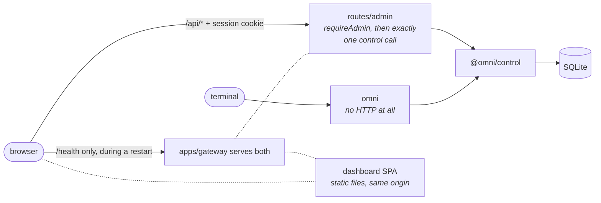

Console is React SPA gateway serves as static files from own origin; may import types and model catalog, never provider adapter or HTTP client. Its one documented exception to "`/api/*` only" is that `/health` edge: restart is exactly window in which no authenticated surface exists to ask, so liveness is one question `/api/*` cannot answer. CLI skips server completely and opens database itself — same operations, no running gateway required.

Reading captured body is one of those operations, not route's own logic: `readRequestBody` decides swept or undecryptable artifact is state to report rather than error to raise, and handler adds no error mapping that could quote path or stack back. Carries no CLI command yet — only asymmetry between the two front ends. `GET /api/settings` additionally reports `bodyLoggingAllowed` beside settings, because runtime toggle meaningless without boot-time key and console knowing only setting would render switch that silently does nothing.

## Plugins

Plugin adds routes, storage and console UI to one installation without being part of this repository. Loaded from `<root>/plugins/` at boot, in lexicographic id order so two installs with same plugins behave same way. `docs/writing-a-plugin.md` is procedure; this section is why shape is what it is.

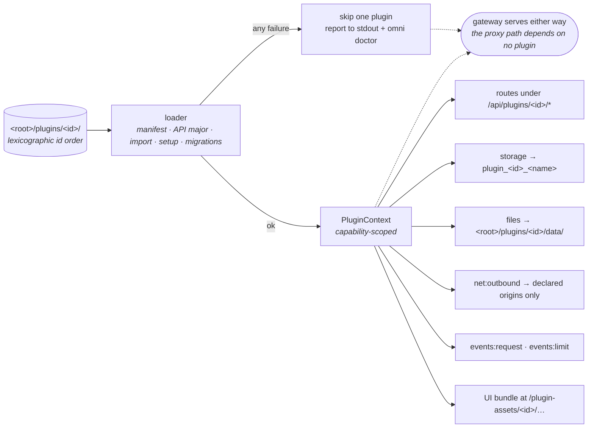

### The trust boundary, which is not one

Plugin is `import`ed into gateway process, and that process holds encryption key, decrypted provider credentials, admin session state and API-key hashes. Bun offers no in-process sandbox. Capability context is therefore **guardrail rather than sandbox**: makes accidental overreach impossible and plugin's intent auditable from its manifest, and does not stop hostile code, which reaches past it by importing store directly.

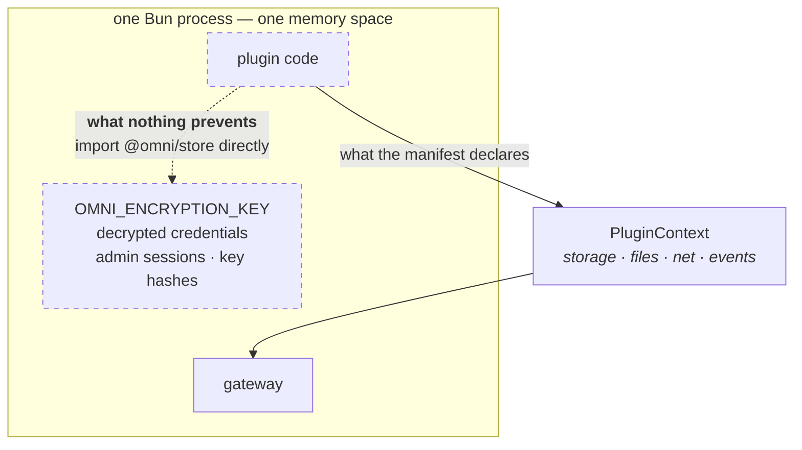

Dashed edge is whole point of section. Not a gap to be closed by better context object; it is what "same process" means. Say it plainly wherever it comes up — reader believing context is sandbox makes worse installation decisions than one who knows it is not.

Supervised subprocess with IPC protocol would be real boundary. Considered and deferred on cost — process supervision, protocol versioning, restart semantics — and decision recorded rather than assumed. If this project ever accepts plugins it does not control, that is point to revisit, before rather than after.

### Every failure is survivable

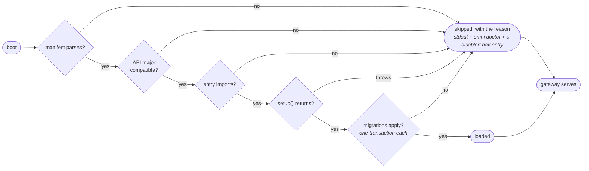

Malformed manifest, incompatible API major, entry that will not import, setup that throws, migration that fails: each skips one plugin, reported to stdout and `omni doctor`, leaves gateway serving. Asymmetry deliberate. Proxy path depends on no plugin and must not become able to, and gateway refusing to start because optional cosmetic feature has syntax error has converted nuisance into outage — while also removing console operator would use to find out which plugin to remove.

### Storage rides the database, on its own track

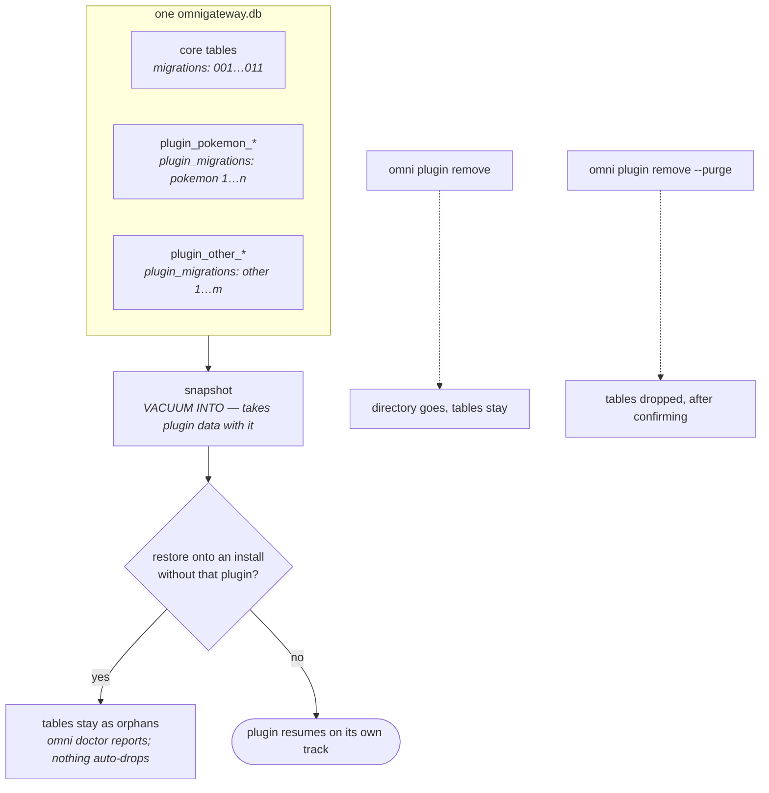

Plugin tables live in gateway's own SQLite file, so plugin data moves with snapshot and restore like everything else. Named `plugin_<id>_<name>` by host from `{{name}}` placeholder plugin writes, tracked in `plugin_migrations` independently of core's numbering — core's next migration unaffected by anything plugin does.

Plugin migrations apply one transaction each rather than one for batch. Single transaction reads tidier and is wrong: plugin failing on migration 5 would silently revert 1 through 4 on every subsequent boot, turning one bad migration into repeated data loss.

Restoring onto install lacking a plugin leaves orphan `plugin_*` tables. They stay, `omni doctor` reports them, nothing drops them automatically — restore is precisely when plugin may not be installed yet, and drop is irreversible.

### Events are at-most-once, and say so

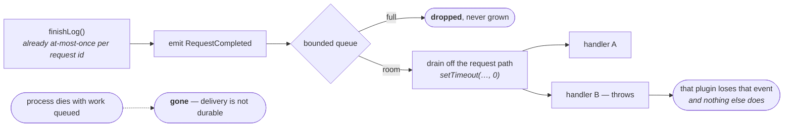

`RequestCompleted` emitted from `finishLog`, already the one site running at most once per request id — same guarantee, same reason, that put rate-limiter's token debit there. Handlers run off request path through bounded queue: nothing runs on caller's stack, throwing handler costs that plugin its event and nothing else, and full queue drops rather than grows, because unbounded queue behind slow handler is memory leak appearing only under load.

Delivery explicitly **not durable**. Event queued when process dies is gone, so anything needing exact accounting reconciles from its own storage instead. Fine for counter, wrong for ledger, and distinction documented rather than left for someone to assume wrong half.

### The console shares one React

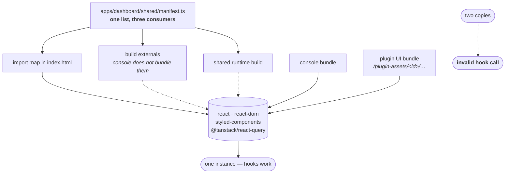

Plugins render inline in console, so both halves must hold same React instance — two copies make every plugin hook throw. So console externalises `react`, `react-dom`, `styled-components` and `@tanstack/react-query` rather than bundling them, and import map in `index.html` resolves those bare specifiers to shared runtime built beside it. Specifier list, import map and shared build's entry points are one object in `apps/dashboard/shared/manifest.ts`, because those three drifting apart fails in three different and equally unhelpful ways.

`sdk` range shipped console does not satisfy disables only UI, and nav entry renders disabled carrying reason. Plugin collecting data should not go dark because console's React moved, and operator should get sentence rather than blank page.