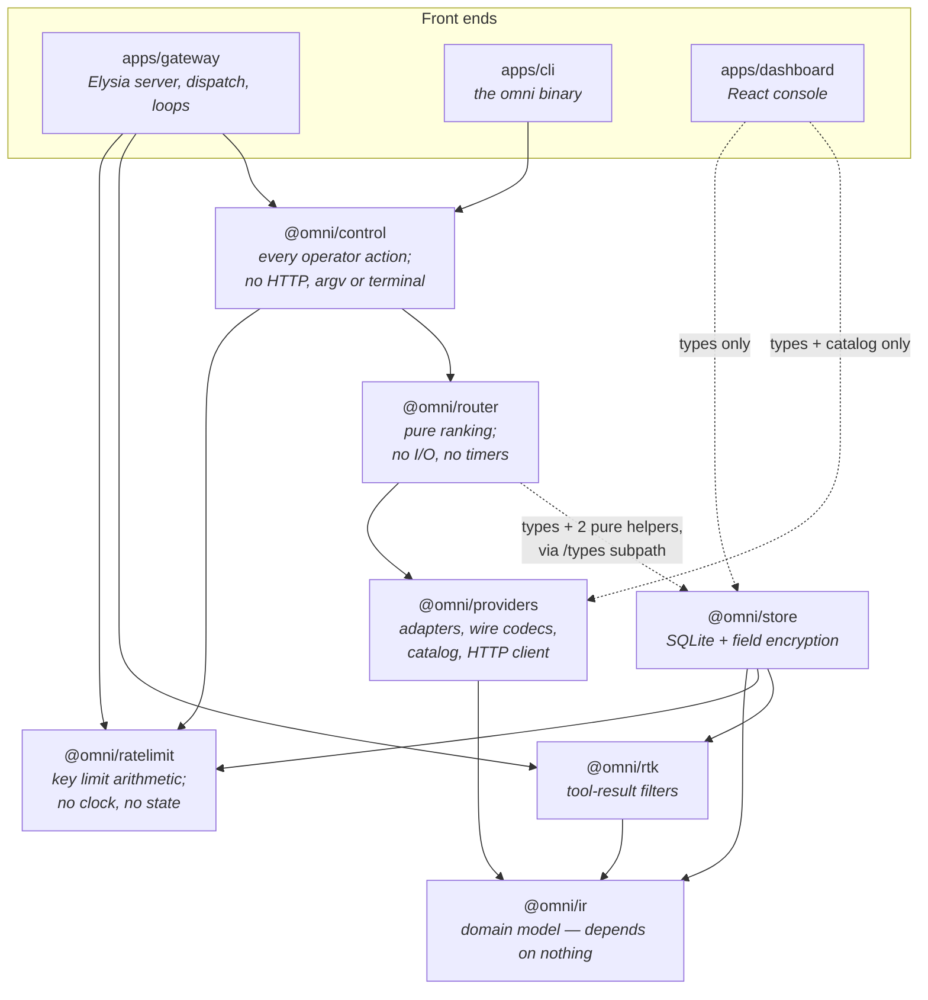

# OmniGateway

One endpoint in front of the AI accounts you already pay for.

OmniGateway is a self-hosted gateway that speaks the Anthropic and OpenAI APIs
and answers them using your own Anthropic, OpenAI, Kimi Coding, Kilo, and xAI
subscriptions. Point any compatible client at it, ask for a model you defined,
and the gateway picks an account that can serve it — falling back to another
when one is rate-limited, expired, or out of quota.

It runs on one machine, stores everything in a local SQLite file, and never
logs the contents of your prompts or replies.

```bash
bun install -g omnigateway
omni start
```

> Status: in use and complete for its scope. Version 1 targets a single
> machine and a single operator — see [Scope](#scope-and-limits).

## What it does

- **Speaks both dialects.** `POST /v1/messages` (Anthropic) and
  `POST /v1/chat/completions` (OpenAI), including streaming, translated to
  whichever provider actually serves the request.
- **Filters bulky tool history, optionally.** Built-in RTK filters shorten
  eligible large or repetitive shell and recognizable command output before
  provider dispatch, preserve errors and non-tool-result content, and default off.
- **Routes across your accounts.** Define a virtual model like `fast` or
  `smart` with several targets; the gateway ranks them by tier, health,
  remaining quota, cost, latency, and current load.
- **Fails over.** A rate-limited or broken account is skipped, its circuit
  breaker opens, and the next candidate is tried — before the response starts
  streaming.
- **Keeps OAuth alive.** Tokens refresh in the background, before a request
  needs them.
- **Watches provider quota.** It asks each provider what you have left and
  routes by *pace*: 5% remaining is fine minutes before a reset and urgent with
  six days to run.
- **Issues its own keys.** Hand out gateway keys with per-key model allowlists
  instead of sharing provider credentials, and bound each one by requests,
  tokens, dollars, or requests in flight — per minute, per five hours, and per
  week.
- **Reports usage.** Requests, tokens, and cost by provider, model, key, and
  day — metadata only.
- **Backs itself up.** Snapshot the database from the console or the CLI, see
  what it occupies, reclaim what deletion left behind, and restore a snapshot
  without stopping the gateway.
- **Ships an admin console and a CLI.** Both cover the same ground; use
  whichever suits the machine you are on.

## How it is built

A Bun workspace monorepo. The layering is deliberate and enforced by what each
package is allowed to import: a provider-neutral core at the bottom, provider
knowledge in one place, pure routing above that, and every side effect pushed up
into the gateway process.



Arrows read *depends on*, and the direction never reverses. Two rules do most of
the work: `@omni/ir` is side-effect free and imports nothing, and `@omni/router`
is a pure function — no network, no database, no timers. Everything that has to
touch the world is pushed up into the gateway process.

`@omni/ratelimit` is the same shape applied to key limits: it decides whether a
request is over a ceiling, and it holds no clock and no counters — `now` is a
parameter and the counts are handed to it, so it never learns whether a number
came from memory or from SQLite. It imports nothing but its schema validator, not
even `@omni/ir`. The rings and the in-flight gauge live in the gateway, because
state is not the package's job, and that split is what lets sliding-window
arithmetic be tested without a gateway, a store, or a clock.

The dashboard's edges are dotted because they are type-level only.
`@omni/providers/catalog` is deliberately kept import-free so model lists can be
bundled into the browser without dragging in the HTTP client.

The router's dotted edge into `@omni/store` is nearly the same story: its
package-root imports are all `import type`. Two pure arithmetic helpers,
`durationFor` and `cacheReadRate`, do run at runtime — imported through the
`@omni/store/types` leaf subpath, so neither SQLite nor crypto enters the
router's module graph and the no-I/O rule holds.

The gateway and the CLI are two front ends over the same `@omni/control`
functions. The CLI does not call the running server's API — it opens the same
SQLite file directly, which is why it still works when the gateway is down.

**[ARCHITECTURE.md](ARCHITECTURE.md)** goes a level deeper: a request traced end
to end, how routing ranks and excludes accounts, the commit point that decides
whether failover is still possible, the provider adapter shape, the database
schema and its encryption boundary, and the background loops.

## Requirements

- [Bun](https://bun.sh/) 1.4 or later. Bun is the runtime, not just the
  installer, so a Node-only machine cannot run OmniGateway.
- A directory that persists, for the SQLite database.
- At least one Anthropic, OpenAI, Kimi Coding, Kilo, or xAI account to connect.

## Install

```bash
bun install -g omnigateway     # or: npm i -g omnigateway
```

One package carries the `omni` CLI, the gateway server, and the admin console
the server hosts.

## Getting started

Pick a directory to hold the database and configuration. `~/.config/omnigateway`
is where `omni` looks by default:

```bash
mkdir -p ~/.config/omnigateway && cd ~/.config/omnigateway
printf 'OMNI_ENCRYPTION_KEY=%s\n' "$(openssl rand -base64 32)" > .env
```

That key encrypts your provider credentials at rest. **Keep it. Changing it
makes every stored credential unreadable**, and there is no recovery path
except reconnecting the accounts.

Then set up and start:

```bash
omni db migrate            # create the database
omni admin set-password    # prompts; the console signs in with this
omni start                 # serves the API and the console on 127.0.0.1:9000
```

Connect an account. The CLI prints a URL to open, and waits:

```bash
omni connect anthropic     # or: openai, kimi, kilo, grok
```

Every provider also takes a plain API key, if that is what you hold rather than
a subscription:

```bash
omni credentials add-key anthropic     # prompts for the key, or reads stdin
```

There is a sixth provider, `custom`, which points an existing wire codec at an
origin you supply — an endpoint you host or pay for that is not one of the five.
It has no subscription to authorize, so there is no `omni connect custom`; it is
an API key plus the endpoint to spend it against:

```bash
omni credentials add-key custom \
  --endpoint-id my-endpoint --endpoint-label 'My endpoint' \
  --origin https://api.example.com --protocol chat-completions
```

`--protocol` is `chat-completions` or `responses`, naming which codec to reuse.
`--origin` is a bare origin — scheme and host, no path, query, or credentials in
the URL.

The console offers the same choice per provider on the Connect dialog.

Define a virtual model your clients will ask for, seeding its pricing and
capabilities from the built-in catalog:

```bash
omni models catalog                                  # what is available
omni models put fast --from-catalog anthropic:claude-sonnet-5
```

Two catalog pricing caveats: xAI doubles its rate at or above 200K context —
the higher rate applies to every token, but a target holds one flat price, so
edit the saved target if you run grok long-context; and Kilo's `kilo-auto/*`
routers carry no published rate, so the router treats them as unpriced rather
than free — set a real `costPerMTok` on the saved target to have one ranked.
Details in [docs/adding-a-provider.md](docs/adding-a-provider.md).

Mint a key for your client. **It is printed once and stored only as a hash:**

```bash
omni keys create --label laptop
```

Bound what the key can do with `--limit <dimension>:<window>=<value>`, repeated
once per pair. An unset pair is unlimited:

```bash
omni keys create --label ci --limit requests:1m=60
```

Every window is *sliding*, so a key cannot spend two windows' allowance either
side of a clock edge. `requests` and `tokens` take `1m`, `5h`, and `1w`; `spend`
takes `5h` and `1w`; `concurrency` is not a window at all but a ceiling on
requests in flight at once.

`tokens` and `spend` are debited once a response completes, because an exact
count exists only then — a key at its ceiling is refused on its *next* request.
The `5h` and `1w` counts derive from `request_logs`, so a `1w` limit on an
installation that prunes logs after three days really enforces three days. They
are cached for thirty seconds and so can read slightly high, never low: refused
early rather than let past a ceiling you set. If the database cannot answer they
stop enforcing and the gateway logs it, while `1m` and `concurrency` are held in
memory and go on enforcing exactly.

> **Breaking:** `--rate-limit N` is removed, not aliased. Use
> `--limit requests:1m=N`. A script still passing the old flag stops with an
> unknown-flag error rather than quietly taking a deprecated path.

Limits are editable after the key exists, unlike `--no-bodies` below. `omni keys
list` prints a compact summary; the full matrix and what has gone against it
need one key's id:

```bash
omni keys limits <id>
omni keys limits <id> --set tokens:1w=50000000
omni keys limits <id> --unset spend:5h
```

`--unset` names a pair that is actually set, so a typo fails rather than
reporting a change it did not make. The usage shown counts completed requests
only, so it reads at or below what the gateway is enforcing, and `concurrency`
shows no figure — that gauge lives in the process, not the database. The
console's Keys screen shows and edits the same matrix.

Now use it:

```bash
curl http://127.0.0.1:9000/v1/chat/completions \
  -H 'content-type: application/json' \
  -H 'authorization: Bearer <gateway-key>' \
  -d '{"model": "fast", "messages": [{"role": "user", "content": "Hello"}]}'
```

Everything above is also available in the browser at
`http://127.0.0.1:9000`, which walks the same steps.

## Using it from a client

| Method | Path | Compatible with |
| --- | --- | --- |
| `POST` | `/v1/messages` | Anthropic Messages API |
| `POST` | `/v1/chat/completions` | OpenAI Chat Completions API |
| `POST` | `/v1/messages/count_tokens` | Anthropic-compatible local token estimation (authenticated) |
| `GET` | `/v1/models` | Listing in both dialects, filtered by your key's allowlist |
| `GET` | `/health` | Unauthenticated liveness check |

Authenticate with either header — sending both is an error:

```http
Authorization: Bearer <gateway-key>
x-api-key: <gateway-key>
```

Ask for one of your virtual models by name. A bare provider model
(`claude-sonnet-5`, `gpt-5`) also works if an account can serve it.

`GET /v1/models` answers both client families from one listing: each entry
carries the OpenAI keys (`object`, `created`, `owned_by`) and the Anthropic ones
(`type`, `display_name`, `created_at`, `max_input_tokens`, `max_tokens`) at
once.

Most tools that accept a custom base URL work unchanged: set it to
`http://127.0.0.1:9000` and use a gateway key where the provider key goes.

### Rate-limit headers

Every response carries the limit headers of the surface you asked on, so an SDK
backs off using the code it already ships — the Anthropic dialect on
`/v1/messages`, the OpenAI one on `/v1/chat/completions`:

```http
anthropic-ratelimit-requests-limit: 2000        x-ratelimit-limit-requests: 2000
anthropic-ratelimit-requests-remaining: 1841    x-ratelimit-remaining-requests: 1841
anthropic-ratelimit-requests-reset: 2026-08-19T14:32:07Z   x-ratelimit-reset-requests: 4h51m22s
```

`requests-remaining` counts the request being answered; `tokens-remaining` does
not and cannot — the response is still being written when the header goes out.
Where a key has several windows on one dimension, the headers report the one
**nearest exhaustion**, not the reassuring ones. `spend` and `concurrency`
render on neither dialect, because no vendor defines a header for them. A
refusal is `429` with `Retry-After` in seconds, computed from the oldest request
still inside the window that refused you.

### Tools and routing

Two kinds of tool behave differently, and the difference decides where a
request can go.

A **custom tool** — a name, a description, and a JSON Schema — is portable. It
translates to every provider, so a request using one routes across your whole
pool as usual.

An **Anthropic-defined tool** — web search, web fetch, code execution, Bash,
text editor, computer use, memory, tool search, advisor, or an MCP toolset —
has a schema Anthropic owns. No other provider can express it, so any request
declaring one, *or replaying the blocks a previous one produced*, is routed to
an Anthropic account only. If the virtual model you asked for has no Anthropic
target, the request fails at routing with the unsupported requirement named,
rather than quietly losing the tool.

The gateway forwards the tool version you send and never upgrades it. Betas
stay yours: send `anthropic-beta` yourself, as the tool requires — the gateway
carries the header through but does not add one on your behalf.

## The CLI

`omni --help` lists everything; `omni <command> --help` explains one. Every
command takes `--json` for scripting, and `--root <path>` to manage an
installation other than the default.

`--root` names the installation, so an `OMNI_DB_PATH` exported in your shell is
ignored alongside it and said so on stderr; that root's own `.env` still decides.
Use `--db <path>` to point one command somewhere else.

| | |
| --- | --- |
| `omni status` | the gateway, its accounts, and their quota, on one screen |
| `omni start` / `stop` / `restart` | run the gateway; `--foreground` attaches it to your terminal |
| `omni doctor` | which installation it resolved, and whether it can act on it |
| `omni logs` | recent requests as the gateway recorded them |
| `omni bodies <request-id>` | captured bodies for one request; withheld unless you pass `--full` |
| `omni console` | the gateway process's own output: boot, refreshes, quota, errors |
| `omni usage` | spend and tokens, by provider, model, key, or day |
| `omni quota` | provider quota per window: use, burn rate, and when it runs out |
| `omni connect <provider>` | authorize an account from the terminal |
| `omni credentials …` | list, show, enable, disable, `set`, `rm`, refresh, `add-key`, health |
| `omni models …` | list, show, put, `rm`, `dry-run`, `catalog` |
| `omni keys …` | list, create, `limits`, revoke |
| `omni plugin …` | list, verify, install, remove; see [Plugins](#plugins) |
| `omni service install` / `uninstall` | write or remove a systemd unit for this installation |
| `omni setup claude` / `opencode` | point a client's config at this gateway |
| `omni settings get` / `set` | routing weights, retention, deadlines, and the runtime switches |
| `omni admin set-password` | change the console password |
| `omni db migrate` | create or upgrade the database |
| `omni db stats` | size on disk, free pages, schema version, and what snapshots are held |
| `omni db backup` / `snapshots` | take a snapshot, and list the ones retention has kept |
| `omni db restore <id>` | put a snapshot back; asks first, and refuses while the gateway is running |
| `omni db vacuum` | rewrite the database, reclaiming the pages deletion left free |

Two worth knowing:

`omni models dry-run fast` shows exactly where a request would go and why —
each candidate's score, and every account that was excluded with the reason.

`omni status` is the "is anything wrong" command: process state, per-account
health, and how much provider quota each account has left.

## Running it as a service

On a machine with systemd:

```bash
omni service install --enable    # writes a user unit for this installation
omni start                       # from here on, start/stop delegate to systemctl
omni console                     # reads the journal (or the log file, without systemd)
```

Use `--system` for a system-wide unit (needs root). Without systemd, `omni
start` supervises the process itself with a pidfile under
`~/.local/state/omnigateway`. Either way, `omni start` returns only once
`/health` actually answers.

### Restarting and stopping from the console

The console can restart and shut down the gateway from the foot of its sidebar.
Restart works under systemd — the gateway asks the manager rather than
signalling itself, because a handled SIGTERM exits cleanly, which systemd's
`Restart=on-failure` reads as success — reports uncertainty in a container,
whose restart policy cannot be read from inside, and disables itself with no
supervisor; use `omni restart` from a terminal there. Shutdown is offered in
every shape. In a container it is a one-way door: bring the process back from
the host.

### Behind a reverse proxy

Set `OMNI_BASE_URL` to the public HTTPS origin, or OAuth callbacks come back to
the wrong host.

Beyond that, two things travel badly through a proxy, and both are streams.
Client responses on `/v1/*` are server-sent events, and the console keeps one
WebSocket open on `/api/stream`. Neither is optional: buffer the first and every
token of an agent's reply arrives at once at the end, and drop the second and
the console silently falls back to polling.

Caddy and Cloudflare pass WebSockets and unbuffered responses by default and
need nothing. nginx needs telling:

```nginx
location / {
    proxy_pass http://127.0.0.1:9000;
    proxy_http_version 1.1;

    # Without these two the Upgrade handshake never reaches the gateway and the
    # console shows LIVE·POLL instead of LIVE·PUSH. It keeps working — the
    # fallback exists for exactly this — but you paid for a socket you are not
    # getting.
    proxy_set_header Upgrade    $http_upgrade;
    proxy_set_header Connection "upgrade";

    proxy_set_header Host              $host;
    proxy_set_header X-Forwarded-Proto $scheme;

    # The socket's heartbeat is 20s and it gives up on a missed pong at 60s.
    # A read timeout below that closes a healthy connection from the outside,
    # and the console reconnects in a loop that looks like an unstable gateway.
    proxy_read_timeout 300s;

    # SSE must not be buffered. The gateway already sends
    # `x-accel-buffering: no` on streaming responses, which nginx honours on its
    # own, so this line is belt and braces for a proxy chain where something
    # else strips that header before nginx sees it.
    proxy_buffering off;
}
```

The gateway sends downstream `: keepalive` comments on streaming responses
because provider heartbeats are decoded away, so an idle stream still looks
alive to whatever sits in between. Keep any idle timeout in the proxy above
your longest expected request.

## Configuration

Configuration is environment variables, read from the installation's `.env`:

| Variable | Required | Default | Purpose |
| --- | --- | --- | --- |
| `OMNI_ENCRYPTION_KEY` | Yes | — | Encrypts provider credentials at rest; 16 characters minimum |
| `OMNI_HOST` | No | `127.0.0.1` | Listener host |
| `OMNI_PORT` | No | `9000` | Listener port |
| `OMNI_DB_PATH` | No | `./omnigateway.db` | SQLite database path |
| `OMNI_BASE_URL` | No | derived from host and port | Public origin for OAuth callbacks; set this behind a reverse proxy |
| `OMNI_STATIC_DIR` | No | the console shipped with the server | Serve a different console build |
| `OMNI_LOG_LEVEL` | No | `info` | Stdout threshold: `debug`, `info`, `warn`, or `error` |
| `OMNI_LOG_FILE` | No | the systemd journal, when there is one | Where stdout was already redirected, so the Console screen can read it back. Names a file; does not create one |
| `OMNI_BODY_LOGGING_ALLOWED` | No | unset | Permits request/response body capture on this installation. Read at boot. Capture also needs the runtime setting; see [Recording bodies](#recording-bodies) |
| `OMNI_EXPOSE_CLAUDE_CODE_ALIASES` | No | off | Advertises the reserved `claude/*` aliases on `/v1/models`. Read at boot |
| `OMNI_ROOT` | No | the installation in the current directory, else `~/.config/omnigateway` | Which installation the CLI acts on, when `--root` is not passed |
| `OMNI_PLUGIN_REGISTRY` | No | the public npm registry | Registry `omni plugin install <name>` resolves through; must be `https://` |

`OMNI_ROOT` is the one variable read from your shell and never from a root's `.env`, for the
reason it has to be: a variable that selects the installation cannot live inside the installation
it selects. A `--root` flag additionally suppresses an ambient `OMNI_DB_PATH`, and says so on
stderr, so pointing the CLI at one installation from inside an unrelated checkout cannot pick up
that checkout's database.

The provider client-identity overrides — `OMNI_UA_*`, `OMNI_ORDER_*`, and the per-provider CLI
version pins — are deliberately left out of this table and documented in `.env.example`. They
change how the gateway identifies itself to a provider, which is not configuration in the sense
the rest of this table is.

Gateway events are written to stdout as one greppable line each: process lifecycle, OAuth
refreshes, quota probes, failover, and errors.

`OMNI_LOG_FILE` *names* where output was captured; it does not redirect it. Setting it alone
leaves the log empty, because the gateway still writes to stdout. Redirect the output and name
the same path:

```bash
bun apps/gateway/src/index.ts >> /var/log/omni.log 2>&1
```

`omni start` does both for the gateway it supervises, and under systemd the journal needs no
setup.

Everything else lives in the database rather than the environment, so it can be
changed without a restart: the six routing weights, `maxAttempts`,
`requestDeadlineMs`, the circuit breaker's `breakerThreshold` and
`breakerCooldownMs`, `logRetentionDays`, `quotaPollIntervalMs`, `rtkEnabled`,
and the two body-capture switches. Edit them with `omni settings set` or in the
console. `quotaPollIntervalMs` is the one exception: the poller reads it once at
boot, so a change to it takes a restart. Snapshot retention —
`snapshotKeepLatest` and `snapshotMaxAgeDays` — is stored alongside them but
deliberately edited on the Database screen instead; see
[Snapshots and restore](#snapshots-and-restore) for why.

## Recording bodies

By default the gateway records no prompts and no responses. For incident
forensics, capture is opt-in and needs **two independent keys, both required**:
`OMNI_BODY_LOGGING_ALLOWED=1` read at boot, plus the **Capture request and
response bodies** setting (console Settings, or `omni settings set
bodyLoggingEnabled true`). An admin session alone cannot start recording your
users' prompts; with the variable unset the console says the switch does
nothing rather than letting you flip it. Capture can be toggled mid-incident;
turning it off stops new capture and does not delete what was written.

A gateway key created with `--no-bodies` is never captured whatever the setting
says — made at issue time, not reversible afterwards; reissue instead. Raw SSE
frames are captured separately, under `bodyLoggingCaptureStreamChunks`, and are
far the larger store.

What is captured: what arrived at `/v1/*` and what was returned, plus every
provider attempt in dispatch order — the client side pre-RTK, attempts post-RTK,
labelled as such in console and CLI. Headers are never captured, at any layer.
Read them from the console's Logs screen or:

```bash
omni bodies req_550e8400-…          # the frame: state, size, one line per attempt
omni bodies req_550e8400-… --full   # the payloads themselves
omni bodies req_550e8400-… --json   # the artifact, for a script
```

The bare command prints only the frame, never conversations — asking costs one
flag. A missing artifact answers rather than errors: `not captured`, `captured,
then lost` (retention or the row cap), or `captured, but unreadable` (usually a
changed `OMNI_ENCRYPTION_KEY`). There is no command to delete a captured body;
a second path that erases forensic evidence on request loses incident records.

Artifacts live at `request_bodies/YYYY/MM/DD/<requestId>.json.enc` beside the
database, AES-256-GCM under `OMNI_ENCRYPTION_KEY`; changing that key invalidates
every artifact. Bounds: log-retention expiry plus a hard **100,000-row cap**, so
capture is forensics, not an archive — size a volume against roughly 100 GB
worst case, though most artifacts are kilobytes.

Masking is best-effort — bearer tokens, vendor-prefixed keys, long opaque
tokens are elided before write — a reduction in exposure, not a guarantee, and
it costs fidelity. Treat the tree as you would the prompts themselves: encrypted
at rest, on a volume you control, never pasted into a ticket.
[ARCHITECTURE.md](ARCHITECTURE.md#body-capture-forensics) documents the storage
format, structural bounds, and masking rules.

## Snapshots and restore

The console's Database screen reports what this installation occupies — the
database file, its write-ahead log, the captured-body tree, and the free pages a
compaction would give back — and takes snapshots. `omni db stats` prints the same
figures.

**What a snapshot is.** One self-contained SQLite file, written into a
`snapshots/` directory beside the database. The write-ahead log is folded in, so
there is nothing else to copy alongside it, and taking one is safe while the
gateway is running: it reads through SQLite rather than copying bytes off disk.

**What it is not.** The sibling `request_bodies/` tree is excluded, always. A
snapshot is never a prompt corpus, and its size tracks your configuration and
usage history rather than your traffic. The cost is that a restore leaves the
captured-body tree out of step with the table: files the restored database has no
row for are collected by the hourly sweep, and a row whose file is gone reads back
as `captured, then lost`.

**A snapshot does carry secrets** — encrypted provider credentials and gateway
key hashes — inert only because `OMNI_ENCRYPTION_KEY` is not in the file.
Anyone holding both the file and the key holds your provider accounts; treat a
downloaded snapshot as the database itself.

**Retention** bounds the directory: at most `keepLatest` snapshots are kept, and
nothing older than `maxAgeDays` — 5 and 30 by default. Both bounds have to pass,
so an old snapshot goes even while the count is under the limit, and the newest is
always kept whatever the numbers say. Pruning runs when a snapshot is taken rather
than on a timer, so a quiet installation keeps what it already has. **Edit the
policy on the Database screen**, not on Settings: it is deliberately not part of
the settings form, so a settings save from a client that has never heard of
retention leaves your policy alone instead of resetting it.

The copy taken automatically on the way into a restore is exempt from retention.
It is the undo.

**Restoring from the console** happens inside the running gateway. Client traffic
on `/v1/*` is refused with a retryable 503 while the file is replaced; `/api/*`
and `/health` keep answering. The screen also uploads a database file from
elsewhere, up to 2 GiB — bring `OMNI_ENCRYPTION_KEY` with it, or the credentials
in it are unreadable. The file is integrity-checked before anything is touched,
and a copy of what was there is taken first. A restore ends by rebuilding the
usage rollup, which briefly blocks even `/api/*`: roughly 0.4 s per 500k
request-log rows, 1.6 s at 2M, 6.5 s at 8M. A failure is logged rather than
raised — the database is live either way, and `omni doctor` reports a rollup
that disagrees with its rows.

**`omni db restore <id>` refuses while a gateway is running** against that
installation, and there is no override flag. A second process can open its own
handle but cannot quiesce the gateway's, and moving the file out from under a live
SQLite connection corrupts the database you were trying to rescue. Run `omni stop`
first, or restore from the console, which swaps the file behind its own quiesce
latch.

**Compaction.** `omni db vacuum`, or the console's equivalent, rewrites the
database and reclaims the pages deletion left free. It holds SQLite's write lock
for the rewrite, so a busy gateway stalls on its writes until it finishes — but
nothing is lost by running it live, and it reports what it actually gave back to
the filesystem.

## Docker

```bash
docker build -t omnigateway .
docker run --rm \
  -p 9000:9000 \
  -e OMNI_ENCRYPTION_KEY="$(openssl rand -base64 32)" \
  -v omnigateway-data:/data \
  omnigateway
```

The container listens on `0.0.0.0:9000` and keeps its database at
`/data/omnigateway.db`. Note that **the image builds the gateway only**: it
serves the APIs and returns 404 for the console. Use the CLI or the control API
against it, or install the npm package if you want the console.

Give the container a restart policy — `--restart unless-stopped` — if you want a
restart request to bring it back. A container cannot read its own policy, so
without one an exit is simply the end of the installation until you start it
again from the host.

## Scope and limits

Worth knowing before you deploy it:

- **One machine, one operator.** No multi-tenancy, no clustering, no shared
  state. The `1m` window and the `concurrency` gauge are counted in the gateway
  process and reset when it restarts; `5h` and `1w` are counted from the database
  and survive one. Two gateways over one database would not see each other's
  short-window counts.
- **Two grains of usage history.** Detailed request logs are pruned after 30
  days by default; a daily rollup is kept for 400 days. A day is your host's
  local midnight, fixed when the row is written.
- **Body capture is forensics, not an archive.** It is off unless you turn it on
  with both keys, it expires on the request-log window, and it is capped at
  100,000 rows. It is not a searchable prompt history and there is no CLI for it.
- **Snapshots are manual, and local.** Nothing takes one on a schedule and there
  is no off-host target; retention bounds what you have taken, and a restore
  always takes one first. Copy them somewhere else yourself if the disk failing
  is what you are guarding against.
- **Quota readings come from the providers**, and their usage endpoints are
  undocumented. An account with nothing reported is treated as unknown, never
  as unlimited.
- **The gateway does not know which model accepts which request shape.** An
  unsupported combination surfaces as the provider's own 400 rather than being
  caught earlier.
- Not in scope for version 1: semantic caching, billing, horizontal scaling.

## Security

- Treat `OMNI_ENCRYPTION_KEY`, gateway keys, and the SQLite file as secrets.
  Anyone with the file *and* the key has your provider credentials.
- Prompts and responses are never logged. Request logs hold metadata and token
  counts only, and no body ever reaches stdout, the journal, or the Console
  screen. Bodies are stored only if you opt in to
  [body capture](#recording-bodies), which needs both an environment variable
  and a setting, encrypts what it writes, and can be refused per key.
- Gateway keys are stored as hashes. A lost key is reissued, not recovered.
- A [snapshot](#snapshots-and-restore) carries whatever the database does —
  encrypted provider credentials, gateway key hashes — and is inert only because
  `OMNI_ENCRYPTION_KEY` is not in it. Captured bodies are excluded, so a snapshot
  is never a prompt corpus.
- Secrets are never accepted on the command line — `omni` prompts for them or
  reads stdin — so they stay out of your shell history and the process table.
- Behind a reverse proxy, set `OMNI_BASE_URL` to the public HTTPS origin so
  OAuth callbacks match what the providers have registered.
- The gateway talks to your providers and to nobody else. No telemetry, no CDN
  fonts, no third-party origins. A plugin may declare outbound origins of its
  own, and `omni plugin verify <id>` shows exactly which ones it asked for — as
  does its manifest, which is a plain file you can read before installing.
- **Plugins run inside the gateway process, with its privileges** — the
  capability context is a guardrail, not a sandbox. Read the
  [security note](#plugins) before installing one you did not write.

## Plugins

A plugin adds routes, storage, and a screen in the console to one installation,
without being part of OmniGateway. Most installations run none.

```bash
omni plugin install ./some-plugin     # a directory, or a .tgz
omni plugin install https://…/x.tgz   # a tarball over https, never http
omni plugin install some-plugin@1.2.3 # a package name, through the npm registry
omni plugin verify some-plugin        # every check the next boot will run
omni plugin list                      # what is installed, and whether it would load
omni restart                          # plugins load at boot, so this is required
```

**Nothing in the package is executed by any of these.** There is no dependency
resolution, no `node_modules`, and no lifecycle script — the installer fetches,
checks, and unpacks, and the plugin's own code is first imported at the next boot.

A spec is resolved filesystem-first: directory, then local tarball, then URL,
then registry. That order is the safe one. The reverse would let a published
package shadow the directory you are standing in and turn `omni plugin install
some-plugin` into a download nobody asked for.

Installing by name refuses more than it accepts, and each refusal happens before
any bytes are fetched: the tarball must be served from the registry's own host,
the registry must advertise an integrity hash or a shasum, and only an exact
version or the registry's `latest` resolves — no ranges, no other dist-tags. Use
`--registry` (or `OMNI_PLUGIN_REGISTRY`) for a private registry; it must be
`https://`.

A URL you type is different, and the difference is the point: nothing downstream
has a digest to check it against, so TLS to the host you named is the only
assurance there is. That is why `http://` is refused rather than upgraded.

`omni plugin list` prints what this installation has — id, name, version, the
plugin API and console SDK it was built against, the capabilities it declared,
and whether the gateway would load it:

```
ID       NAME               VERSION  API  SDK     CAPABILITIES                    STATE
pokemon  Pokémon Companion  1.0.0    1    ^1.0.0  storage,files,net:outbound,…    ok
```

A plugin that would *not* load is listed with the reason rather than hidden,
because a plugin missing from the console is exactly what you are trying to
explain. For one plugin's full detail — its entry points and the outbound
origins it declared — use `omni plugin verify <id>`.

### Available plugins

There is no curated directory to browse, and there is no plan for one. A plugin
is a directory, a tarball, a URL or a package name you point `omni plugin
install` at, and you are expected to know where it came from — see the
[security note](#security) for why that is the model rather than an omission.

Resolving a name through npm makes distribution easier; it does not make an
unknown plugin safer. Integrity checking proves you received the bytes the
registry advertised, and nothing about who wrote them or what they do once the
gateway imports them.

None ship in this repository, deliberately. The first one did, and moving it out
is what proved the plugin API actually works from outside: while it built as a
workspace sibling it could reach internal packages no published plugin can, and
two bugs hid in exactly that gap.

| Plugin | What it does |
| --- | --- |
| [`@omnigateway/pokemon`](https://github.com/harismawan/omnigateway-plugin-pokemon) | A Pokémon companion. Each gateway key raises one that hatches, evolves, and graduates into a Pokédex on the tokens that key spends, with a shop that spends a wallet of those same tokens. |

```bash
omni plugin install @omnigateway/pokemon
omni plugin verify pokemon
omni restart
```

It needs outbound access to `pokeapi.co` and `raw.githubusercontent.com` for
species data and sprites, which its manifest declares and `omni plugin verify
pokemon` prints back. Those assets are Nintendo and Game Freak intellectual
property, fetched at runtime and never vendored — into that repository, this one,
or anything either publishes.

`verify` is the one to run before restarting a gateway that people are using: it
reaches the same verdict the next boot will, from the same code, without loading
the plugin.

### Installing on a machine with no checkout

A published plugin installs by name — no checkout, no build toolchain:

```bash
omni plugin install omnigateway-plugin-example
omni plugin verify example && omni restart
```

Building and shipping your own plugin — tarball layout, the manifest-at-root
rule, why plaintext `http://` stays refused, Docker mounting — is covered in
[docs/writing-a-plugin.md](docs/writing-a-plugin.md).

**In Docker**, mount the plugin at `<root>/plugins/<id>` on a volume — the same
layout `install` writes — and restart the container; read-write, not `:ro`,
because a plugin declaring `files` writes its cache inside its own directory.
See [docs/writing-a-plugin.md](docs/writing-a-plugin.md).

Removing one keeps its data:

```bash
omni plugin remove some-plugin          # directory goes, database tables stay
omni plugin remove some-plugin --purge  # tables too, after confirming
```

That default is deliberate. A plugin directory can be reinstalled from the
package it came from; whatever it accumulated in your database cannot be
reinstalled from anything.

Note what "directory goes" includes: a plugin's `data/` directory is removed
with it. That directory holds cached files a plugin can rebuild — it is excluded
from [snapshots](#snapshots-and-restore) for that reason, so it has no restore
path and is not meant to need one. Only the database tables are kept, and only
those are what `--purge` additionally drops. For the same reason, restoring a snapshot onto an
installation that no longer has a plugin leaves that plugin's tables in place —
`omni doctor` reports them, and nothing removes them for you.

Read the [security note](#security) on what a plugin can reach before installing
one you did not write. To write one, see
[docs/writing-a-plugin.md](docs/writing-a-plugin.md).

## Development

Contributing, or running from a checkout? See
[ARCHITECTURE.md](ARCHITECTURE.md) for how the system fits together,
[CLAUDE.md](CLAUDE.md) for the repository map, architectural boundaries, and
conventions, [docs/adding-a-provider.md](docs/adding-a-provider.md) for the
provider checklist, and `docs/superpowers/specs/` for the design documents
behind each feature.

```bash
git clone https://github.com/harismawan/omnigateway.git
cd omnigateway
bun install
cp .env.example .env          # then set OMNI_ENCRYPTION_KEY
bun run build:dashboard       # the gateway serves this build
bun run dev                   # gateway on 9000, with file watching
```

Releases are published to npm from a `v*` tag, with provenance attesting which
commit produced them.
