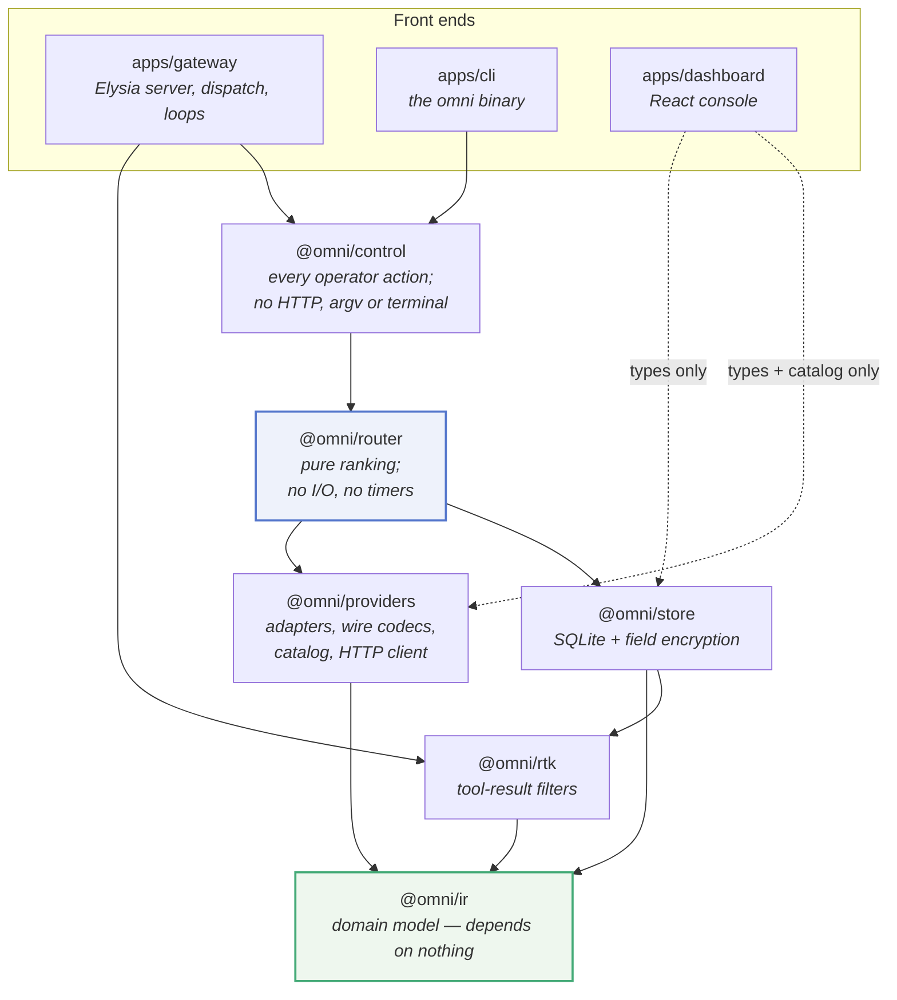
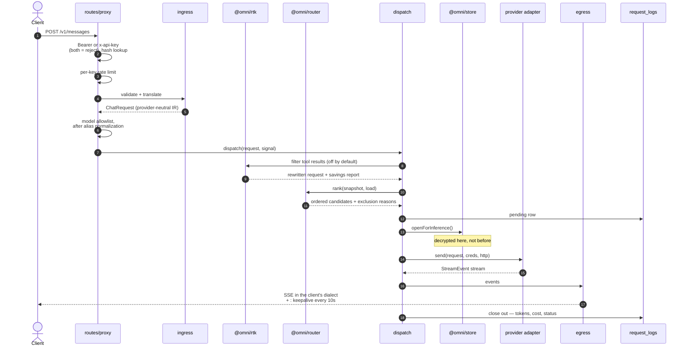
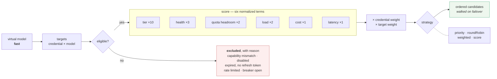
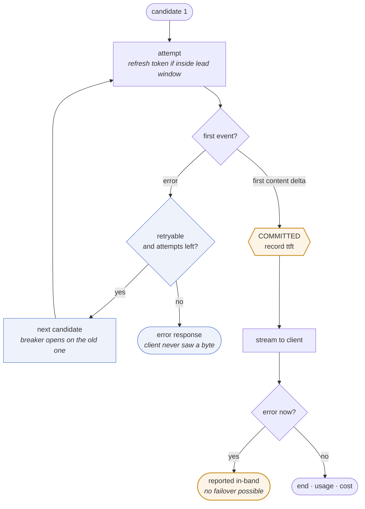
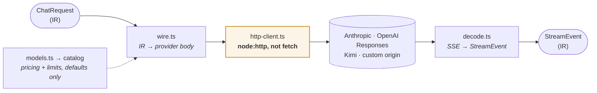
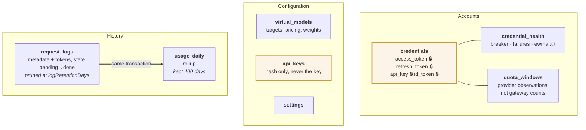
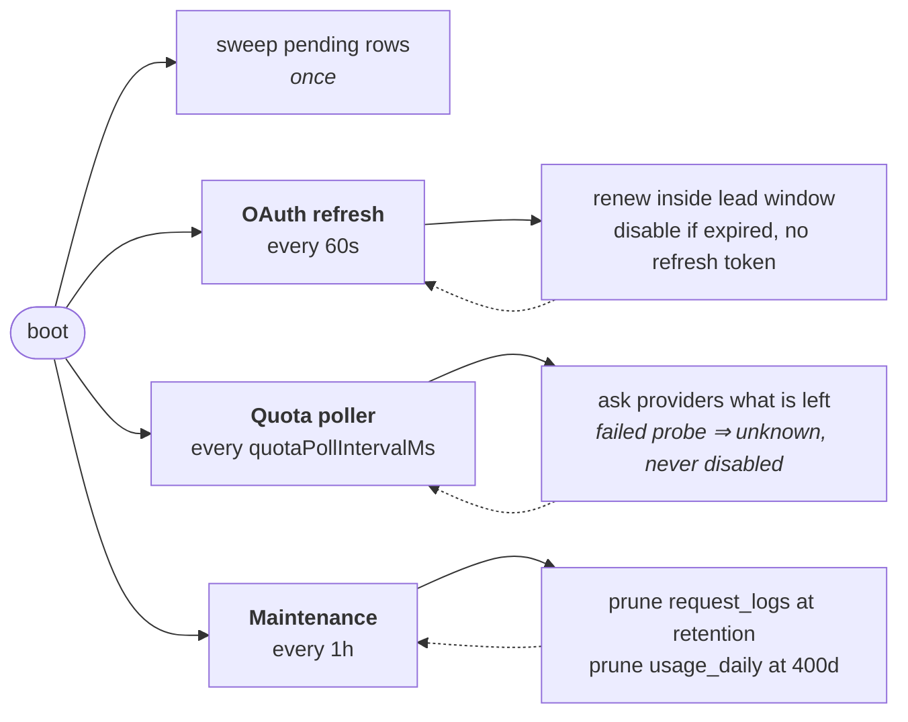
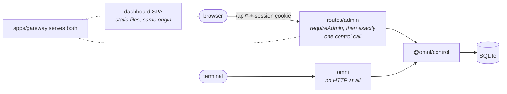

# OmniGateway

One endpoint in front of the AI accounts you already pay for.

OmniGateway is a self-hosted gateway that speaks the Anthropic and OpenAI APIs
and answers them using your own Anthropic, OpenAI, and Kimi Coding
subscriptions. Point any compatible client at it, ask for a model you defined,
and the gateway picks an account that can serve it — falling back to another
when one is rate-limited, expired, or out of quota.

It runs on one machine, stores everything in a local SQLite file, and never
logs the contents of your prompts or replies.

```bash
bun install -g omnigateway
omni start
```

> Status: in use and complete for its scope. Version 1 targets a single
> machine and a single operator — see [Scope](#scope-and-limits).

## What it does

- **Speaks both dialects.** `POST /v1/messages` (Anthropic) and
  `POST /v1/chat/completions` (OpenAI), including streaming, translated to
  whichever provider actually serves the request.
- **Filters bulky tool history, optionally.** Built-in RTK filters shorten
  eligible large or repetitive shell and recognizable command output before
  provider dispatch, preserve errors and non-tool-result content, and default off.
- **Routes across your accounts.** Define a virtual model like `fast` or
  `smart` with several targets; the gateway ranks them by tier, health,
  remaining quota, cost, latency, and current load.
- **Fails over.** A rate-limited or broken account is skipped, its circuit
  breaker opens, and the next candidate is tried — before the response starts
  streaming.
- **Keeps OAuth alive.** Tokens refresh in the background, before a request
  needs them.
- **Watches provider quota.** It asks each provider what you have left and
  routes by *pace*: 5% remaining is fine minutes before a reset and urgent with
  six days to run.
- **Issues its own keys.** Hand out gateway keys with per-key model allowlists
  and rate limits instead of sharing provider credentials.
- **Reports usage.** Requests, tokens, and cost by provider, model, key, and
  day — metadata only.
- **Ships an admin console and a CLI.** Both cover the same ground; use
  whichever suits the machine you are on.

## How it is built

A Bun workspace monorepo. The layering is deliberate and enforced by what each
package is allowed to import: a provider-neutral core at the bottom, provider
knowledge in one place, pure routing above that, and every side effect pushed up
into the gateway process.

### The packages



Arrows read *depends on*, and the direction never reverses. Two rules do most of
the work: `@omni/ir` is side-effect free and imports nothing, and `@omni/router`
is a pure function — no network, no database, no timers. Everything that has to
touch the world is pushed up into the gateway process.

The dashboard's edges are dotted because they are type-level only.
`@omni/providers/catalog` is deliberately kept import-free so model lists can be
bundled into the browser without dragging in the HTTP client.

The gateway and the CLI are two front ends over the same `@omni/control`
functions. The CLI does not call the running server's API — it opens the same
SQLite file directly, which is why it still works when the gateway is down.

### What a request actually does

`POST /v1/messages` and `POST /v1/chat/completions` are the same handler; the
dialect is a parameter.



Two details the diagram flattens. Credentials are decrypted at step 13 and not a
moment earlier, so ranking ten candidates costs zero decryptions. And the log row
is opened before the first attempt and closed exactly once — a client that hangs
up mid-stream is recorded as such, not as a success.

`GET /v1/models` is answered from the routing snapshot with no provider call, and
`POST /v1/messages/count_tokens` is estimated locally — it deliberately writes no
usage row.

### Routing

The router is a pure function over an immutable snapshot of credentials, health,
quota, models, and settings, plus a live count of in-flight requests. It returns
candidates in the order to try them, and every excluded account with its reason —
which is exactly what `omni models dry-run` prints.



Weights shown are the defaults and are configurable. A request carrying an
Anthropic-defined tool is excluded from every non-Anthropic target at the filter
stage — which is why it fails at routing with the requirement named, rather than
quietly losing the tool. The breaker's cooldown scales with consecutive failures.

Nothing here is thrown away: the exclusion list with its reasons is exactly what
`omni models dry-run` prints.

### Dispatch

Dispatch is where the side effects the router refuses to have actually live: the
request deadline, retries, failover, token refresh, health writes, cost pricing,
and load accounting.

The important rule is the **commit point**:



Everything left of the commit point is invisible to the client: a rate-limited or
broken account is swapped for another and the request simply succeeds. Everything
right of it is not, and pretending otherwise would corrupt the stream.

Circuit-breaker state and latency are written back on every terminal outcome, so
the next request's ranking reflects this one.

### Providers

Four adapters, each a directory of the same four files:



The `custom` adapter points another provider's codec at a different origin.

All outbound HTTP goes through one client, and that client is built on
`node:http` rather than `fetch` for a specific reason: Bun's `fetch` alphabetizes
request headers, which destroys the header order and casing providers use to
recognize a first-party CLI. The client preserves both verbatim, and logs only
host, path, status, and duration.

The catalog supplies defaults — pricing and context limits — at the moment you
create a target. The router then prices from the saved target, so editing the
catalog affects new targets only.

### Storage

One SQLite file, WAL mode, six migrations.



Writing the rollup in the *same transaction* as the log row is what lets a year of
usage history survive the 30-day pruning of the detailed logs.

Encryption is a boundary, not a pass. Only the four 🔒 fields are sealed, with
AES-256-GCM under a key derived from `OMNI_ENCRYPTION_KEY`, and decryption is
lazy and purpose-scoped — a credential opens *for inference*, *for refresh*, or
*for usage*, so ranking ten candidates costs zero decryptions. Gateway API keys
are not stored at all, only their hashes.

### Background loops

Three, started at boot and stopped on signal:



Setting `quotaPollIntervalMs` to zero disables the poller entirely; it is read
once at boot. Retiring the `pending` rows at startup is what stops a crash from
double-counting usage.

### The console and the CLI

Two front ends, one set of operations, two very different paths to it:



The console is a React SPA the gateway serves as static files from its own
origin; it may import types and the model catalog, never a provider adapter or
the HTTP client. The CLI skips the server completely and opens the database
itself — same operations, no running gateway required.

## Requirements

- [Bun](https://bun.sh/) 1.4 or later. Bun is the runtime, not just the
  installer, so a Node-only machine cannot run OmniGateway.
- A directory that persists, for the SQLite database.
- At least one Anthropic, OpenAI, or Kimi Coding account to connect.

## Install

```bash
bun install -g omnigateway     # or: npm i -g omnigateway
```

One package carries the `omni` CLI, the gateway server, and the admin console
the server hosts.

## Getting started

Pick a directory to hold the database and configuration. `~/.config/omnigateway`
is where `omni` looks by default:

```bash
mkdir -p ~/.config/omnigateway && cd ~/.config/omnigateway
printf 'OMNI_ENCRYPTION_KEY=%s\n' "$(openssl rand -base64 32)" > .env
```

That key encrypts your provider credentials at rest. **Keep it. Changing it
makes every stored credential unreadable**, and there is no recovery path
except reconnecting the accounts.

Then set up and start:

```bash
omni db migrate            # create the database
omni admin set-password    # prompts; the console signs in with this
omni start                 # serves the API and the console on 127.0.0.1:9000
```

Connect an account. The CLI prints a URL to open, and waits:

```bash
omni connect anthropic     # or: openai, kimi
```

Define a virtual model your clients will ask for, seeding its pricing and
capabilities from the built-in catalog:

```bash
omni models catalog                                  # what is available
omni models put fast --from-catalog anthropic:claude-sonnet-5
```

Mint a key for your client. **It is printed once and stored only as a hash:**

```bash
omni keys create --label laptop
```

Now use it:

```bash
curl http://127.0.0.1:9000/v1/chat/completions \
  -H 'content-type: application/json' \
  -H 'authorization: Bearer <gateway-key>' \
  -d '{"model": "fast", "messages": [{"role": "user", "content": "Hello"}]}'
```

Everything above is also available in the browser at
`http://127.0.0.1:9000`, which walks the same steps.

## Using it from a client

| Method | Path | Compatible with |
| --- | --- | --- |
| `POST` | `/v1/messages` | Anthropic Messages API |
| `POST` | `/v1/chat/completions` | OpenAI Chat Completions API |
| `POST` | `/v1/messages/count_tokens` | Anthropic-compatible local token estimation (authenticated) |
| `GET` | `/v1/models` | Listing in both dialects, filtered by your key's allowlist |
| `GET` | `/health` | Unauthenticated liveness check |

Authenticate with either header — sending both is an error:

```http
Authorization: Bearer <gateway-key>
x-api-key: <gateway-key>
```

Ask for one of your virtual models by name. A bare provider model
(`claude-sonnet-5`, `gpt-5`) also works if an account can serve it.

`GET /v1/models` answers both client families from one listing: each entry
carries the OpenAI keys (`object`, `created`, `owned_by`) and the Anthropic ones
(`type`, `display_name`, `created_at`, `max_input_tokens`, `max_tokens`) at
once.

Most tools that accept a custom base URL work unchanged: set it to
`http://127.0.0.1:9000` and use a gateway key where the provider key goes.

### Tools and routing

Two kinds of tool behave differently, and the difference decides where a
request can go.

A **custom tool** — a name, a description, and a JSON Schema — is portable. It
translates to every provider, so a request using one routes across your whole
pool as usual.

An **Anthropic-defined tool** — web search, web fetch, code execution, Bash,
text editor, computer use, memory, tool search, advisor, or an MCP toolset —
has a schema Anthropic owns. No other provider can express it, so any request
declaring one, *or replaying the blocks a previous one produced*, is routed to
an Anthropic account only. If the virtual model you asked for has no Anthropic
target, the request fails at routing with the unsupported requirement named,
rather than quietly losing the tool.

The gateway forwards the tool version you send and never upgrades it. Betas
stay yours: send `anthropic-beta` yourself, as the tool requires — the gateway
carries the header through but does not add one on your behalf.

## The CLI

`omni --help` lists everything; `omni <command> --help` explains one. Every
command takes `--json` for scripting, and `--root <path>` to manage an
installation other than the default.

| | |
| --- | --- |
| `omni status` | the gateway, its accounts, and their quota, on one screen |
| `omni start` / `stop` / `restart` | run the gateway; `--foreground` attaches it to your terminal |
| `omni doctor` | which installation it resolved, and whether it can act on it |
| `omni logs` | recent requests as the gateway recorded them |
| `omni console` | the gateway process's own output: boot, refreshes, quota, errors |
| `omni usage` | spend and tokens, by provider, model, key, or day |
| `omni connect <provider>` | authorize an account from the terminal |
| `omni credentials …` | list, show, enable, disable, retier, refresh, remove |
| `omni models …` | list, show, put, remove, `dry-run`, `catalog` |
| `omni keys …` | list, create, revoke |
| `omni settings get` / `set` | routing weights, retention, deadlines |
| `omni admin set-password` | change the console password |
| `omni db migrate` | create or upgrade the database |

Two worth knowing:

`omni models dry-run fast` shows exactly where a request would go and why —
each candidate's score, and every account that was excluded with the reason.

`omni status` is the "is anything wrong" command: process state, per-account
health, and how much provider quota each account has left.

## Running it as a service

On a machine with systemd:

```bash
omni service install --enable    # writes a user unit for this installation
omni start                       # from here on, start/stop delegate to systemctl
omni console                     # reads the journal (or the log file, without systemd)
```

Use `--system` for a system-wide unit (needs root). Without systemd, `omni
start` supervises the process itself with a pidfile under
`~/.local/state/omnigateway`. Either way, `omni start` returns only once
`/health` actually answers.

## Configuration

Configuration is environment variables, read from the installation's `.env`:

| Variable | Required | Default | Purpose |
| --- | --- | --- | --- |
| `OMNI_ENCRYPTION_KEY` | Yes | — | Encrypts provider credentials at rest; 16 characters minimum |
| `OMNI_HOST` | No | `127.0.0.1` | Listener host |
| `OMNI_PORT` | No | `9000` | Listener port |
| `OMNI_DB_PATH` | No | `./omnigateway.db` | SQLite database path |
| `OMNI_BASE_URL` | No | derived from host and port | Public origin for OAuth callbacks; set this behind a reverse proxy |
| `OMNI_STATIC_DIR` | No | the console shipped with the server | Serve a different console build |
| `OMNI_LOG_LEVEL` | No | `info` | Stdout threshold: `debug`, `info`, `warn`, or `error` |
| `OMNI_LOG_FILE` | No | the systemd journal, when there is one | Where stdout was already redirected, so the Console screen can read it back. Names a file; does not create one |

Gateway events are written to stdout as one greppable line each: process lifecycle, OAuth
refreshes, quota probes, failover, and errors.

`OMNI_LOG_FILE` *names* where output was captured; it does not redirect it. Setting it alone
leaves the log empty, because the gateway still writes to stdout. Redirect the output and name
the same path:

```bash
bun apps/gateway/src/index.ts >> /var/log/omni.log 2>&1
```

`omni start` does both for the gateway it supervises, and under systemd the journal needs no
setup.

Routing behaviour — weights, retry limits, request deadline, log retention,
how often provider quota is polled — lives in the database, not the
environment. Edit it with `omni settings set` or in the console.

`.env.example` in the repository documents the optional provider
client-identity overrides.

## Docker

```bash
docker build -t omnigateway .
docker run --rm \
  -p 9000:9000 \
  -e OMNI_ENCRYPTION_KEY="$(openssl rand -base64 32)" \
  -v omnigateway-data:/data \
  omnigateway
```

The container listens on `0.0.0.0:9000` and keeps its database at
`/data/omnigateway.db`. Note that **the image builds the gateway only**: it
serves the APIs and returns 404 for the console. Use the CLI or the control API
against it, or install the npm package if you want the console.

## Scope and limits

Worth knowing before you deploy it:

- **One machine, one operator.** No multi-tenancy, no clustering, no shared
  state. Rate limits are counted per process and reset when it restarts.
- **Two grains of usage history.** Detailed request logs are pruned after 30
  days by default; a daily rollup is kept for 400 days. A day is your host's
  local midnight, fixed when the row is written.
- **Quota readings come from the providers**, and their usage endpoints are
  undocumented. An account with nothing reported is treated as unknown, never
  as unlimited.
- **The gateway does not know which model accepts which request shape.** An
  unsupported combination surfaces as the provider's own 400 rather than being
  caught earlier.
- Not in scope for version 1: semantic caching, billing, prompt storage,
  horizontal scaling.

## Security

- Treat `OMNI_ENCRYPTION_KEY`, gateway keys, and the SQLite file as secrets.
  Anyone with the file *and* the key has your provider credentials.
- Prompts and responses are never logged. Request logs hold metadata and token
  counts only.
- Gateway keys are stored as hashes. A lost key is reissued, not recovered.
- Secrets are never accepted on the command line — `omni` prompts for them or
  reads stdin — so they stay out of your shell history and the process table.
- Behind a reverse proxy, set `OMNI_BASE_URL` to the public HTTPS origin so
  OAuth callbacks match what the providers have registered.
- The gateway talks to your providers and to nobody else. No telemetry, no CDN
  fonts, no third-party origins.

## Development

Contributing, or running from a checkout? See [CLAUDE.md](CLAUDE.md) for the
repository map, architectural boundaries, and conventions, and
`docs/superpowers/specs/` for the design documents behind each feature.

```bash
git clone https://github.com/harismawan/omnigateway.git
cd omnigateway
bun install
cp .env.example .env          # then set OMNI_ENCRYPTION_KEY
bun run build:dashboard       # the gateway serves this build
bun run dev                   # gateway on 9000, with file watching
```

Releases are published to npm from a `v*` tag, with provenance attesting which
commit produced them.
