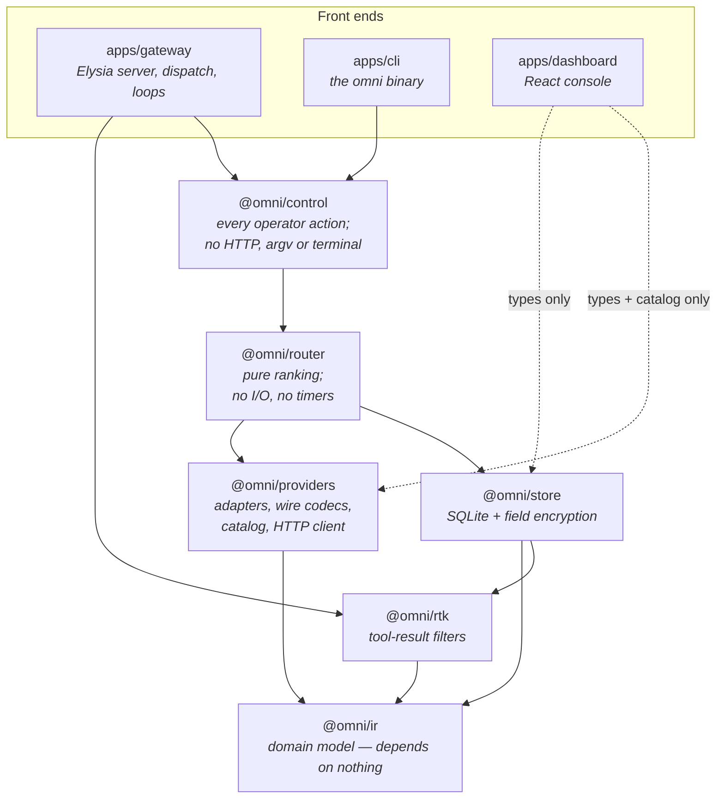

# OmniGateway

One endpoint in front of the AI accounts you already pay for.

OmniGateway is a self-hosted gateway that speaks the Anthropic and OpenAI APIs
and answers them using your own Anthropic, OpenAI, Kimi Coding, Kilo, and xAI
subscriptions. Point any compatible client at it, ask for a model you defined,
and the gateway picks an account that can serve it — falling back to another
when one is rate-limited, expired, or out of quota.

It runs on one machine, stores everything in a local SQLite file, and never
logs the contents of your prompts or replies.

```bash
bun install -g omnigateway
omni start
```

> Status: in use and complete for its scope. Version 1 targets a single
> machine and a single operator — see [Scope](#scope-and-limits).

## What it does

- **Speaks both dialects.** `POST /v1/messages` (Anthropic) and
  `POST /v1/chat/completions` (OpenAI), including streaming, translated to
  whichever provider actually serves the request.
- **Filters bulky tool history, optionally.** Built-in RTK filters shorten
  eligible large or repetitive shell and recognizable command output before
  provider dispatch, preserve errors and non-tool-result content, and default off.
- **Routes across your accounts.** Define a virtual model like `fast` or
  `smart` with several targets; the gateway ranks them by tier, health,
  remaining quota, cost, latency, and current load.
- **Fails over.** A rate-limited or broken account is skipped, its circuit
  breaker opens, and the next candidate is tried — before the response starts
  streaming.
- **Keeps OAuth alive.** Tokens refresh in the background, before a request
  needs them.
- **Watches provider quota.** It asks each provider what you have left and
  routes by *pace*: 5% remaining is fine minutes before a reset and urgent with
  six days to run.
- **Issues its own keys.** Hand out gateway keys with per-key model allowlists
  and rate limits instead of sharing provider credentials.
- **Reports usage.** Requests, tokens, and cost by provider, model, key, and
  day — metadata only.
- **Ships an admin console and a CLI.** Both cover the same ground; use
  whichever suits the machine you are on.

## How it is built

A Bun workspace monorepo. The layering is deliberate and enforced by what each
package is allowed to import: a provider-neutral core at the bottom, provider
knowledge in one place, pure routing above that, and every side effect pushed up
into the gateway process.



Arrows read *depends on*, and the direction never reverses. Two rules do most of
the work: `@omni/ir` is side-effect free and imports nothing, and `@omni/router`
is a pure function — no network, no database, no timers. Everything that has to
touch the world is pushed up into the gateway process.

The dashboard's edges are dotted because they are type-level only.
`@omni/providers/catalog` is deliberately kept import-free so model lists can be
bundled into the browser without dragging in the HTTP client.

The gateway and the CLI are two front ends over the same `@omni/control`
functions. The CLI does not call the running server's API — it opens the same
SQLite file directly, which is why it still works when the gateway is down.

**[ARCHITECTURE.md](ARCHITECTURE.md)** goes a level deeper: a request traced end
to end, how routing ranks and excludes accounts, the commit point that decides
whether failover is still possible, the provider adapter shape, the database
schema and its encryption boundary, and the background loops.

## Requirements

- [Bun](https://bun.sh/) 1.4 or later. Bun is the runtime, not just the
  installer, so a Node-only machine cannot run OmniGateway.
- A directory that persists, for the SQLite database.
- At least one Anthropic, OpenAI, Kimi Coding, Kilo, or xAI account to connect.

## Install

```bash
bun install -g omnigateway     # or: npm i -g omnigateway
```

One package carries the `omni` CLI, the gateway server, and the admin console
the server hosts.

## Getting started

Pick a directory to hold the database and configuration. `~/.config/omnigateway`
is where `omni` looks by default:

```bash
mkdir -p ~/.config/omnigateway && cd ~/.config/omnigateway
printf 'OMNI_ENCRYPTION_KEY=%s\n' "$(openssl rand -base64 32)" > .env
```

That key encrypts your provider credentials at rest. **Keep it. Changing it
makes every stored credential unreadable**, and there is no recovery path
except reconnecting the accounts.

Then set up and start:

```bash
omni db migrate            # create the database
omni admin set-password    # prompts; the console signs in with this
omni start                 # serves the API and the console on 127.0.0.1:9000
```

Connect an account. The CLI prints a URL to open, and waits:

```bash
omni connect anthropic     # or: openai, kimi, kilo, grok
```

Every provider also takes a plain API key, if that is what you hold rather than
a subscription. `custom` takes nothing else:

```bash
omni credentials add-key anthropic     # prompts for the key, or reads stdin
```

The console offers the same choice per provider on the Connect dialog.

Define a virtual model your clients will ask for, seeding its pricing and
capabilities from the built-in catalog:

```bash
omni models catalog                                  # what is available
omni models put fast --from-catalog anthropic:claude-sonnet-5
```

**A note on grok pricing.** xAI charges by request size: at or above 200K
context the rate roughly doubles, and the higher rate applies to *every token
in the request*, not just the tokens past the mark. A target holds one flat
price, so the catalog carries xAI's sub-200K figures and long-context traffic
is reported cheaper than it was billed. Catalog pricing is only the default a
new target starts from — if you run grok at long context, edit the saved
target's price to match the tier you are actually paying.

**A note on `kilo-auto/*` pricing.** Kilo's `frontier`, `balanced`, and
`efficient` routers choose an upstream model per request, and Kilo states no
rate for them. The catalog records zero, which the router reads as *unpriced*
and leaves out of its cost ranking — the same stored figure `kilo-auto/free`
carries because it genuinely is free. So a `kilo-auto` target seeded from the
catalog is not free, it is unranked: cost never counts for or against it. If you
want one ranked against your other accounts, set a real `costPerMTok` on the
saved target for the tier you expect it to land in.

Mint a key for your client. **It is printed once and stored only as a hash:**

```bash
omni keys create --label laptop
```

Now use it:

```bash
curl http://127.0.0.1:9000/v1/chat/completions \
  -H 'content-type: application/json' \
  -H 'authorization: Bearer <gateway-key>' \
  -d '{"model": "fast", "messages": [{"role": "user", "content": "Hello"}]}'
```

Everything above is also available in the browser at
`http://127.0.0.1:9000`, which walks the same steps.

## Using it from a client

| Method | Path | Compatible with |
| --- | --- | --- |
| `POST` | `/v1/messages` | Anthropic Messages API |
| `POST` | `/v1/chat/completions` | OpenAI Chat Completions API |
| `POST` | `/v1/messages/count_tokens` | Anthropic-compatible local token estimation (authenticated) |
| `GET` | `/v1/models` | Listing in both dialects, filtered by your key's allowlist |
| `GET` | `/health` | Unauthenticated liveness check |

Authenticate with either header — sending both is an error:

```http
Authorization: Bearer <gateway-key>
x-api-key: <gateway-key>
```

Ask for one of your virtual models by name. A bare provider model
(`claude-sonnet-5`, `gpt-5`) also works if an account can serve it.

`GET /v1/models` answers both client families from one listing: each entry
carries the OpenAI keys (`object`, `created`, `owned_by`) and the Anthropic ones
(`type`, `display_name`, `created_at`, `max_input_tokens`, `max_tokens`) at
once.

Most tools that accept a custom base URL work unchanged: set it to
`http://127.0.0.1:9000` and use a gateway key where the provider key goes.

### Tools and routing

Two kinds of tool behave differently, and the difference decides where a
request can go.

A **custom tool** — a name, a description, and a JSON Schema — is portable. It
translates to every provider, so a request using one routes across your whole
pool as usual.

An **Anthropic-defined tool** — web search, web fetch, code execution, Bash,
text editor, computer use, memory, tool search, advisor, or an MCP toolset —
has a schema Anthropic owns. No other provider can express it, so any request
declaring one, *or replaying the blocks a previous one produced*, is routed to
an Anthropic account only. If the virtual model you asked for has no Anthropic
target, the request fails at routing with the unsupported requirement named,
rather than quietly losing the tool.

The gateway forwards the tool version you send and never upgrades it. Betas
stay yours: send `anthropic-beta` yourself, as the tool requires — the gateway
carries the header through but does not add one on your behalf.

## The CLI

`omni --help` lists everything; `omni <command> --help` explains one. Every
command takes `--json` for scripting, and `--root <path>` to manage an
installation other than the default.

`--root` names the installation, so an `OMNI_DB_PATH` exported in your shell is
ignored alongside it and said so on stderr; that root's own `.env` still decides.
Use `--db <path>` to point one command somewhere else.

| | |
| --- | --- |
| `omni status` | the gateway, its accounts, and their quota, on one screen |
| `omni start` / `stop` / `restart` | run the gateway; `--foreground` attaches it to your terminal |
| `omni doctor` | which installation it resolved, and whether it can act on it |
| `omni logs` | recent requests as the gateway recorded them |
| `omni bodies <request-id>` | captured bodies for one request; withheld unless you pass `--full` |
| `omni console` | the gateway process's own output: boot, refreshes, quota, errors |
| `omni usage` | spend and tokens, by provider, model, key, or day |
| `omni quota` | provider quota per window: use, burn rate, and when it runs out |
| `omni connect <provider>` | authorize an account from the terminal |
| `omni credentials …` | list, show, enable, disable, retier, refresh, remove |
| `omni models …` | list, show, put, remove, `dry-run`, `catalog` |
| `omni keys …` | list, create, revoke |
| `omni settings get` / `set` | routing weights, retention, deadlines, and the runtime switches |
| `omni admin set-password` | change the console password |
| `omni db migrate` | create or upgrade the database |
| `omni db stats` | size on disk, free pages, schema version, and what snapshots are held |
| `omni db backup` / `snapshots` | take a snapshot, and list the ones retention has kept |
| `omni db restore <id>` | put a snapshot back; asks first, and refuses while the gateway is running |
| `omni db vacuum` | rewrite the database, reclaiming the pages deletion left free |

Two worth knowing:

`omni models dry-run fast` shows exactly where a request would go and why —
each candidate's score, and every account that was excluded with the reason.

`omni status` is the "is anything wrong" command: process state, per-account
health, and how much provider quota each account has left.

## Running it as a service

On a machine with systemd:

```bash
omni service install --enable    # writes a user unit for this installation
omni start                       # from here on, start/stop delegate to systemctl
omni console                     # reads the journal (or the log file, without systemd)
```

Use `--system` for a system-wide unit (needs root). Without systemd, `omni
start` supervises the process itself with a pidfile under
`~/.local/state/omnigateway`. Either way, `omni start` returns only once
`/health` actually answers.

## Configuration

Configuration is environment variables, read from the installation's `.env`:

| Variable | Required | Default | Purpose |
| --- | --- | --- | --- |
| `OMNI_ENCRYPTION_KEY` | Yes | — | Encrypts provider credentials at rest; 16 characters minimum |
| `OMNI_HOST` | No | `127.0.0.1` | Listener host |
| `OMNI_PORT` | No | `9000` | Listener port |
| `OMNI_DB_PATH` | No | `./omnigateway.db` | SQLite database path |
| `OMNI_BASE_URL` | No | derived from host and port | Public origin for OAuth callbacks; set this behind a reverse proxy |
| `OMNI_STATIC_DIR` | No | the console shipped with the server | Serve a different console build |
| `OMNI_LOG_LEVEL` | No | `info` | Stdout threshold: `debug`, `info`, `warn`, or `error` |
| `OMNI_LOG_FILE` | No | the systemd journal, when there is one | Where stdout was already redirected, so the Console screen can read it back. Names a file; does not create one |
| `OMNI_BODY_LOGGING_ALLOWED` | No | unset | Permits request/response body capture on this installation. Read at boot. Capture also needs the runtime setting; see [Recording bodies](#recording-bodies) |

Gateway events are written to stdout as one greppable line each: process lifecycle, OAuth
refreshes, quota probes, failover, and errors.

`OMNI_LOG_FILE` *names* where output was captured; it does not redirect it. Setting it alone
leaves the log empty, because the gateway still writes to stdout. Redirect the output and name
the same path:

```bash
bun apps/gateway/src/index.ts >> /var/log/omni.log 2>&1
```

`omni start` does both for the gateway it supervises, and under systemd the journal needs no
setup.

Routing behaviour — weights, retry limits, request deadline, log retention,
how often provider quota is polled — lives in the database, not the
environment. Edit it with `omni settings set` or in the console.

`.env.example` in the repository documents the optional provider
client-identity overrides.

## Recording bodies

By default the gateway records no prompts and no responses. If you need them for
an incident — to see what a client actually sent, or what a provider actually
returned — capture is opt-in and takes **two independent keys, both required**:

1. `OMNI_BODY_LOGGING_ALLOWED=1` in the installation's `.env`, read at boot.
2. The **Capture request and response bodies** setting, in the console's
   Settings screen or `omni settings set bodyLoggingEnabled true`. Off by
   default. Raw SSE frames are the separate, far larger
   `bodyLoggingCaptureStreamChunks`.

Two keys, because an admin session on its own must not be able to start
recording your users' prompts. With the environment variable unset the setting
does nothing at all, and the console says so rather than letting you flip a
switch that silently no-ops. With the environment variable set you can turn
capture on and off mid-incident without restarting.

Turning capture off stops new capture. It does not delete what was already
written.

**Per-key opt-out.** A gateway key can be created with *Never record this key's
bodies* — `omni keys create --no-bodies` — and it is then never captured whatever
the setting says. Use it for a client whose payloads must not be retained. The
choice is made when the key is issued and cannot be reversed afterwards; reissue
the key instead. `omni keys list` and the console's Keys screen both show which
keys are exempt, so an audit does not have to go through the database.

**What is captured.** What arrived at `/v1/*` and what was returned, plus the
request and response of every provider attempt, in dispatch order. The client
request is the conversation *before* RTK compression and each attempt request is
the one *after* it, so an artifact is the only place you can read what a filter
actually removed. The console labels which side is which, and so does the CLI.

**Reading them.** Expand a row on the console's Logs screen, or from a terminal:

```bash
omni bodies req_550e8400-…          # the frame: state, size, one line per attempt
omni bodies req_550e8400-… --full   # the payloads themselves
omni bodies req_550e8400-… --json   # the artifact, for a script
```

**The bare command withholds the bodies and prints only the frame.** Every other
read in the CLI prints everything it has; this one prints conversations. A
terminal keeps scrollback, a multiplexer keeps a logged pane, and whoever runs
this during an incident is usually sharing that screen. Asking for the bodies
costs one flag; printing them by default costs a prompt corpus in someone's
session log, silently. The frame still tells you the detail state, when the
capture landed, its size on disk, whether anything was truncated, and each
attempt's provider and byte counts — labelled `pre-RTK` for the client request
and `post-RTK` for every attempt request, because those are not the same payload.

A request with no artifact is an answer rather than an error, and the three
answers are different: `not captured` means capture was not running, `captured,
then lost` means retention or the row cap has been through, and `captured, but
unreadable` means the file is there but will not decrypt — usually a changed
`OMNI_ENCRYPTION_KEY`.

There is no CLI command to delete a captured body. Retention, the row cap, and
the orphan sweep are the gateway's; a second path that erases forensic evidence
on request is a way to lose an incident record.

**What is never captured.** Headers, at any layer — every provider authenticates
through headers, so that is where the tokens are. That one is a guarantee: the
capture layer is never handed a header list, so no provider, present or future,
can opt its own in.

**Masking is best-effort, and a body corpus is sensitive even after it.** Bodies
are masked before they are written, replacing bearer tokens, `sk-`/`ak-`/`pk-`
prefixed keys, the well-known vendor prefixes (`ghp_` and the rest of GitHub's,
`github_pat_`, `AIza`, `GOCSPX-`, `xai-`), and any long opaque token with elided
forms. Two things follow, and both matter before you turn capture on:

- It costs fidelity. The length rule has no idea what it is looking at, so it
  also elides base64 image data, content hashes, and minified source. That is
  deliberate: a corpus that leaks a live credential is the worse failure.
- It does not catch everything. The length rule is tuned to base64url, so a
  standard-base64 secret or an AWS secret access key can slip through it on a
  `+` or a `/`, and a credential shorter than forty-one characters or exactly
  forty characters long — an Azure OpenAI key, for instance — is out of its reach
  entirely. The prefix rules exist precisely because the length rule cannot be
  the whole answer, and between them they are a reduction in exposure, not a
  guarantee of none.

Treat the artifact tree as you would treat the prompts themselves: it is
encrypted at rest, it belongs on a volume you control, and it is not something to
copy into a ticket.

Nothing changes about stdout. Prompts and responses never reach the log, the
journal, or the Console screen; capture is a separate encrypted store.

**Where it goes.** `request_bodies/YYYY/MM/DD/<requestId>.json.enc` beside the
database file, encrypted with AES-256-GCM under `OMNI_ENCRYPTION_KEY`, the same
key as your provider credentials. Copies taken without the key yield nothing.
Changing the key invalidates every artifact already written.

**Bounds.** Two limits, because either alone fails:

- Bodies expire on the same **log retention** window as request rows, swept
  hourly, file and row deleted together.
- A hard cap of **100,000 body rows**, oldest pruned first. The window is what
  you reason about; the row cap is what actually bounds disk, because a week's
  window over sustained traffic bounds nothing.

Individual payloads are bounded structurally rather than by byte offset — strings
past 64 KB, arrays to their last 24 items, nesting past 6 levels, objects to 80
keys — so a stored artifact is always valid JSON. An artifact still over 512 KB
after that has its bodies replaced by a marker recording why.

**Sizing a volume.** 512 KB is a *plaintext* cap and encryption emits hex, so one
artifact can reach roughly 1 MB on disk. With the 100,000-row cap, the worst case
for the whole body corpus is therefore about **100 GB**, not 50. Real traffic is
nowhere near that — most artifacts are a few kilobytes — but that is the number
to size against if you enable capture on a busy gateway.

**Sizing memory.** The same 512 KB is also the cap on each captured body held in
memory while a request is in flight, and there is one of those per side per
attempt. Worst case per captured request is therefore about 512 KB × (attempts +
1), so a request that fails over twice can hold a few megabytes until it
finishes. Multiply by your concurrency before enabling capture on a small box.

## Docker

```bash
docker build -t omnigateway .
docker run --rm \
  -p 9000:9000 \
  -e OMNI_ENCRYPTION_KEY="$(openssl rand -base64 32)" \
  -v omnigateway-data:/data \
  omnigateway
```

The container listens on `0.0.0.0:9000` and keeps its database at
`/data/omnigateway.db`. Note that **the image builds the gateway only**: it
serves the APIs and returns 404 for the console. Use the CLI or the control API
against it, or install the npm package if you want the console.

## Scope and limits

Worth knowing before you deploy it:

- **One machine, one operator.** No multi-tenancy, no clustering, no shared
  state. Rate limits are counted per process and reset when it restarts.
- **Two grains of usage history.** Detailed request logs are pruned after 30
  days by default; a daily rollup is kept for 400 days. A day is your host's
  local midnight, fixed when the row is written.
- **Body capture is forensics, not an archive.** It is off unless you turn it on
  with both keys, it expires on the request-log window, and it is capped at
  100,000 rows. It is not a searchable prompt history and there is no CLI for it.
- **Quota readings come from the providers**, and their usage endpoints are
  undocumented. An account with nothing reported is treated as unknown, never
  as unlimited.
- **The gateway does not know which model accepts which request shape.** An
  unsupported combination surfaces as the provider's own 400 rather than being
  caught earlier.
- Not in scope for version 1: semantic caching, billing, horizontal scaling.

## Security

- Treat `OMNI_ENCRYPTION_KEY`, gateway keys, and the SQLite file as secrets.
  Anyone with the file *and* the key has your provider credentials.
- Prompts and responses are never logged. Request logs hold metadata and token
  counts only, and no body ever reaches stdout, the journal, or the Console
  screen. Bodies are stored only if you opt in to
  [body capture](#recording-bodies), which needs both an environment variable
  and a setting, encrypts what it writes, and can be refused per key.
- Gateway keys are stored as hashes. A lost key is reissued, not recovered.
- Secrets are never accepted on the command line — `omni` prompts for them or
  reads stdin — so they stay out of your shell history and the process table.
- Behind a reverse proxy, set `OMNI_BASE_URL` to the public HTTPS origin so
  OAuth callbacks match what the providers have registered.
- The gateway talks to your providers and to nobody else. No telemetry, no CDN
  fonts, no third-party origins.

## Development

Contributing, or running from a checkout? See
[ARCHITECTURE.md](ARCHITECTURE.md) for how the system fits together,
[CLAUDE.md](CLAUDE.md) for the repository map, architectural boundaries, and
conventions, and `docs/superpowers/specs/` for the design documents behind each
feature.

```bash
git clone https://github.com/harismawan/omnigateway.git
cd omnigateway
bun install
cp .env.example .env          # then set OMNI_ENCRYPTION_KEY
bun run build:dashboard       # the gateway serves this build
bun run dev                   # gateway on 9000, with file watching
```

Releases are published to npm from a `v*` tag, with provenance attesting which
commit produced them.
